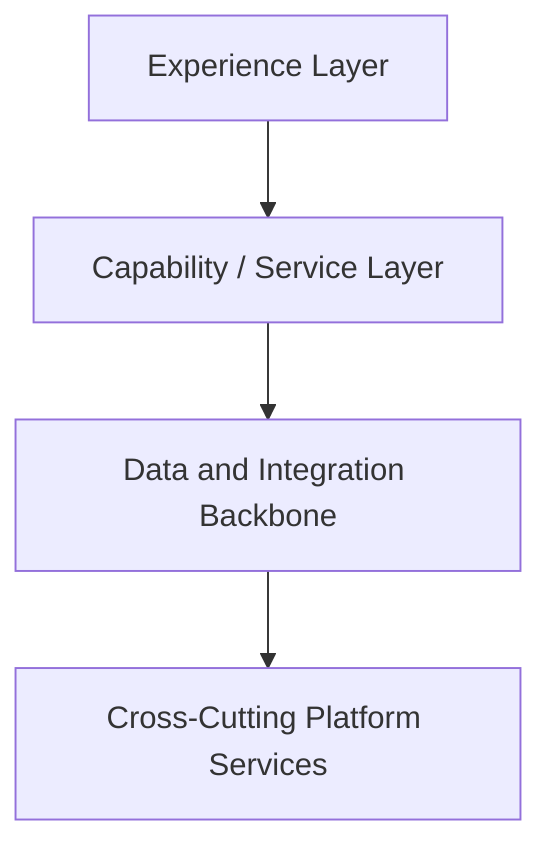

# Functional Domain Reference Architecture Defined

A Functional Domain Reference Architecture (FDRA) is the governed set of artifacts that
describe how a business-capability aligned domain (for example Supply Chain, Finance, or
Commercial) is architected end to end. It bridges strategy and execution by connecting
business outcomes to capabilities, capabilities to systems, and systems to the enterprise
guardrail framework of Policies, Principles, Positions, Practices, and Standards.

## Purpose and Scope

- The value of an FDRA is **speed to execution with consistency** — teams reuse a shared
  capability model, approved patterns, and standards instead of re-deriving them per project.
- An FDRA is the connective tissue between the [Functional Architecture
  Domains](../domains/ArchitectureDomainsFunctional.md) and the [Technology Architecture
  Domains](../domains/ArchitectureDomainsTechnology.md).
- It plugs directly into the [Architecture Assurance Guardrail
  Framework](07-architecture-assurance-guardrails.md) and the [Architecture
  Checklist](architecture-checklist.md) used at the Technology Review Board.

## The FDRA Artifact Set

Each functional domain should maintain the following seven artifacts, layered from strategy
to execution. Reuse the existing enterprise templates where indicated.

| # | Artifact | Template to reuse | Purpose |
| --- | --- | --- | --- |
| 1 | Domain Overview & Capability Map | This document, section below | Bounded capabilities, ownership, and target business outcomes |
| 2 | Domain Principles | [Architecture Principles](02-architecture-principles-and-template.md) | Domain-specific guidance as Statement / Rationale / Implications |
| 3 | Domain Positions | [Architecture Positions](03-architecture-positions-and-template.md) | When-to-use / when-not-to-use decisions on technology and approach |
| 4 | Reference Architecture Blueprint | This document, section below | Logical layers, capability-to-system mapping, and integration seams |
| 5 | Domain Patterns | [Architecture Patterns](05-architecture-patterns-and-template.md) | Repeatable Context / Problem / Solution / Sketch patterns |
| 6 | Standards & Approved Technology | Domain `standards.md` | Common solutions, approved products, and versions |
| 7 | Assurance Checklist (domain slice) | [Architecture Checklist](architecture-checklist.md) | Domain-tailored review gate for the Technology Review Board |

## Recommended Folder Convention

Co-locate the artifacts under the domain so navigation matches content:

```text
docs/domains/<functional-domain>/
  overview.md                 # 1 - capability map
  principles.md               # 2
  positions.md                # 3
  reference-architecture.md   # 4 - blueprint
  patterns/                   # 5 - domain patterns
  standards.md                # 6
  assurance-checklist.md      # 7
```

---

## TEMPLATE 1 — Domain Overview & Capability Map

### Domain Summary

- One-paragraph description of the business domain and the outcomes it exists to enable.
- Domain owner(s) and contributing architects.

### Capability Model

- List the bounded capabilities in the domain. Each capability should have a single
  responsibility, a clear interface, and an explicit owner so that change is a configuration
  problem rather than a reconstruction problem.

| Capability | Description | Owner | Primary Systems |
| --- | --- | --- | --- |
| Capability name | What it does and its boundary | Owner | Systems that realize it |

### Business Outcomes and OKR Alignment

- Map each target business outcome to the load-bearing capabilities and the systems that
  realize them, so the thread from outcome to architecture stays traceable.

| Business Outcome | Key Result / Metric | Load-Bearing Capability | Horizon (Now / Next / Future) |
| --- | --- | --- | --- |
| Outcome | Measurable KR | Capability | Now |

---

## TEMPLATE 4 — Reference Architecture Blueprint

Use the following structure for the domain blueprint. It mirrors the structure used in the
[reference architecture patterns](../patterns/application/ai-patterns.md) so reviews stay
consistent.

### Document Control

- **Version:** 0.1
- **Status:** Draft – Pending Architecture Review
- **Audience:** Solution Architects, Domain Architects, Security and Operations Teams

### 1. Purpose, Scope and Applicability

- What the blueprint covers, the environments in scope, and who should use it.

### 2. Business Context and Capability Model

- Summarize the capability model from Template 1 and the business processes it supports.

### 3. Business Outcomes and OKR Alignment

- Restate the outcome-to-capability-to-system traceability relevant to this blueprint.

### 4. Architecture Principles

- Enterprise principles, domain-specific principles, and security principles that constrain
  the design. Link to the domain `principles.md`.

### 5. Logical Reference Architecture

- A layered diagram of the domain. Show the experience layer, the capability/service layer,
  the data and integration backbone, and cross-cutting platform services.



### 6. Capability-to-System Mapping

| Capability | Current System(s) | Disposition (Build / Buy / Integrate) | Gap |
| --- | --- | --- | --- |
| Capability | System | Integrate | Description of gap |

### 7. Data and Integration Seams

- Identify the handoffs between capabilities and the formal data contract at each seam.
  Handoffs are where the thread most often breaks, so each transition needs a contract, not
  just a file transfer.

### 8. Cross-Cutting Concerns

- Security and Identity and Access Management
- Observability, logging, and monitoring
- Data governance, lineage, and master data
- AI and analytics enablement

### 9. Approved Patterns

- Link to the domain patterns in `patterns/` and to enterprise patterns that apply.

### 10. Standards and Approved Technologies

- Link to the domain `standards.md` and to enterprise standards.

### 11. Non-Functional Requirements

- Performance, scalability, availability, resilience, and compliance targets.

### 12. Assurance and Governance

- Link to the domain `architecture-assurance-checklist.md` and describe the Technology Review Board gate.

### 13. Glossary

- Definitions for domain-specific terms.
