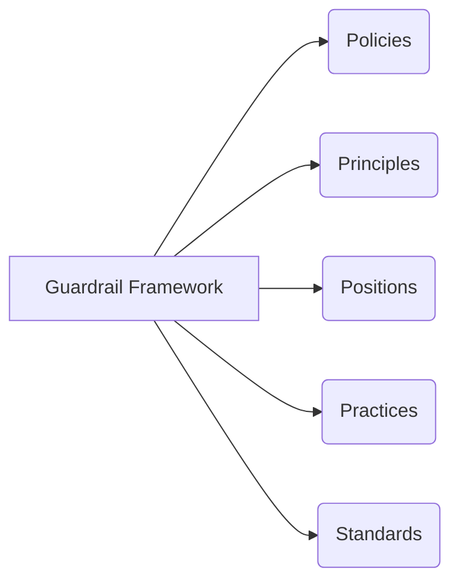

# Architecture Assurance Guardrail Framework

## Working Definitions

- **Policies**
  - Statement of Compliance
  - We need to ensure there is uniform adherence to a core set of non-negotiable principles and practices required to fulfill our strategy
  - [Policies and Standards: Cybersecurity, Operational, Application & System](https://entegris.sharepoint.com/sites/ensider-dept-it/SitePages/PPSF.aspx)

- **Principles**
  - [Architecture Principles Defined](02-architecture-principles-and-template.md)
  - Simple statements of values and beliefs
  - We need to provide general purpose guidance to drive capability and solution decisions

- **Positions**
  - [Architecture Positions Defined](03-architecture-positions-and-template.md)
  - [Architecture Patterns Defined](05-architecture-patterns-and-template.md)
  - Detailed point of view on a complex topic [When to Use/ When Not to Use]
  - There are a series of complex & sometimes interdependent areas where we need to articulate a point of view to address the complexity

- **Practices**
  - Procedural view on "how" we operate
  - It's important to create, document and follow a set of standard procedures as we partner, acquire, operate and sometimes build new solutions

- **Standards**
  - Areas where we want to have a common solution
  - Having standards streamlines decisions and support, strengthens purchasing that clarifies what we want to invest in, improves IT risk management & mitigation
  - Architecture Decision Log

## Framework Diagram

This framework provides governance through coordinated policies, principles, positions, practices, and standards that guide all architecture decisions at Entegris.
