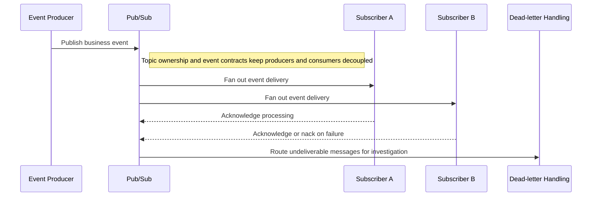
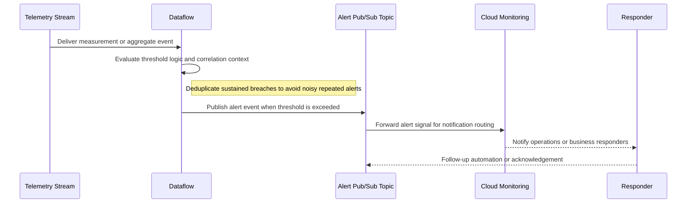

# Reference Architecture — Event-Driven Architecture Patterns (Time-Series & IoT)

## Event-Driven and Time-Series Patterns

**Version:** 0.1
**Status:** Draft – Pending Architecture Review
**Audience:** Solution Architects, Integration Engineers, Security and Operations Teams

---

## Document Introduction

### Purpose of Document

This document defines approved event-driven and time-series patterns for Entegris solutions on GCP. It helps teams standardize on Pub/Sub, Dataflow, and analytical sinks for asynchronous and telemetry-centric workloads.

- The value of the pattern is speed to execution — leveraging what others have done before and quickly achieving business outcomes
- A pattern is best expressed as: When to use, When Not to use certain technologies/approaches
- This document is for designers and architects who need to design asynchronous event and time-series solutions that scale cleanly across Entegris platforms
- If implemented properly, these patterns enable you to get to production as fast as possible and have the most stable, scalable, and maintenance-free set of applications possible

### Scope and Applicability

These patterns cover enterprise event bus usage, time-series ingestion, and alert generation for streaming workloads.

- Asynchronous integration through Pub/Sub and Dataflow on GCP
- Time-series analytics and threshold-driven alerting for telemetry-rich domains

**Environments:**

- Cloud
- Hybrid

### Intended Audience

- Solution Architects
- Data Engineers
- Integration Engineers
- Security and Operations Teams

---

## Context

- Pub/Sub is the enterprise event bus standard and should replace ad hoc point-to-point queue designs
- Dataflow is the approved stream processing engine for filtering, windowing, enrichment, and aggregation
- BigQuery is the default analytical sink for time-series workloads, with Bigtable considered only when throughput or latency demands it
- Late-arriving events: use event time not processing time; define allowed lateness window (e.g., 1 hour for IoT sensor data)

### Why Use These Patterns

- Reduce cost through consolidation of functionality
- Agility through solutions based on a set of services that supports restructuring and reconfiguration of business processes
- Time-to-market through business-aligned solutions
- Alignment between IT and business goals, enabling re-use over time

---

## Architecture Principles

### Enterprise Principles

- Loosely Coupled and Interoperable Solutions
- Remove Friction
- Keep It Simple

### Domain-Specific Principles

- OT and IT Architecture Convergence
- Observability and Reliability by Design
- Data Quality at the Source

### Security Principles

- Security and Privacy by Design
- Defense in Depth
- Security Assurance Through Least Privilege

---

## High-Level Solution Patterns

| Solution | When to Use | When Not to Use |
|---|---|---|
| Event Bus Pattern |• Need asynchronous integration between producers and consumers<br>• Multiple downstream systems may subscribe over time|• The interaction is strictly synchronous request/reply<br>• A proprietary broker is being proposed without an exception|
| Time-Series Ingestion Pattern |• Need high-volume telemetry or sensor data processing<br>• Windowing, enrichment, or aggregation is required|• The payload is a simple low-volume business event with no time-series behavior<br>• Batch ingestion is sufficient for the use case|
| Threshold Alert Pattern |• Need automated response when a stream crosses business or operational thresholds<br>• Alerts must be generated from streaming analytics outputs|• Teams plan to poll analytical tables for alerts instead of reacting to the stream<br>• Thresholds are not stable enough to operate in near real time|

---

## Pattern Selection Matrix

| Scenario Cue | Throughput | Analytics Need | Direction | Recommended Pattern | Notes |
| --- | --- | --- | --- | --- | --- |
| Async business event distribution | Moderate | Decoupled fan-out | Producer → Consumers | Event Bus Pattern | Use Pub/Sub with at-least-once delivery; design consumers to be idempotent |
| Sensor telemetry into analytics | High | Windowed time-series analysis | Device → GCP analytics | Time-Series Ingestion Pattern | Use Dataflow for windowed aggregation; partition BigQuery by measurement_timestamp_utc |
| Operational threshold breach notification | Moderate to high | Real-time detection and alerting | Stream → Notification | Threshold Alert Pattern | Integrate Cloud Monitoring alerts with PagerDuty for 24/7 on-call incident response |

---

## Canonical Patterns

### Event Bus Pattern

| Area | Description |
|---|---|
| **Context** | Multiple systems need to exchange events asynchronously without hardwiring producers to each consumer. The organization wants one standard event backbone across domains. |
| **Problem** | How do we distribute business events broadly without creating brittle point-to-point integrations? |
| **Solution** | • Use Pub/Sub as the enterprise event bus for publishing and subscribing to asynchronous events<br>• Define event contracts, topic ownership, and subscription responsibilities so producers and consumers remain decoupled<br>• Monitor delivery, dead-letter handling, and consumer lag as first-class operational metrics |
| **Benefits** | • Decouples publishers from subscribers and supports future reuse<br>• Scales well for multiple downstream consumers with different processing needs<br>• Aligns asynchronous integration to a single managed platform standard |
| **Considerations** | • Event schemas and ownership need governance so topics do not become ambiguous dumping grounds<br>• Consumers must be designed to handle retries and potential duplicate delivery semantics appropriately |

### Time-Series Ingestion Pattern

| Area | Description |
|---|---|
| **Context** | A workload generates ordered telemetry or measurement data that must be processed continuously for analytics. The stream may arrive out of order and at high scale. |
| **Problem** | How do we ingest and process time-series data so analytics remain accurate even with late or bursty events? |
| **Solution** | • Use Pub/Sub when event rate is <10K msgs/sec; evaluate Kafka on GKE for sustained throughput >10K msgs/sec before applying Dataflow event-time windowing and enrichment<br>• Write analytical outputs to partitioned BigQuery tables and evaluate Bigtable for very high-throughput raw storage needs<br>• Retain raw events in GCS so historical replay and backfill remain possible |
| **Benefits** | • Supports scalable near-real-time analytics for telemetry-heavy domains<br>• Improves correctness by handling late-arriving events with event-time semantics<br>• Keeps raw and processed data available for investigation and replay |
| **Considerations** | • Window size, lateness, and storage design directly affect cost and analytical correctness<br>• Schema evolution for time-series payloads must be managed carefully across producers and consumers |

### Threshold Alert Pattern

| Area | Description |
|---|---|
| **Context** | Streaming analytics must trigger a response when measurements or derived metrics cross a defined threshold. Operators need alerting fast enough to influence action. |
| **Problem** | How do we generate timely alerts from streaming data without forcing users to poll dashboards or query stores continuously? |
| **Solution** | • Use Dataflow or equivalent streaming logic to evaluate thresholds on incoming events or aggregates<br>• Publish alert events to a dedicated Pub/Sub topic and integrate the resulting signal with Cloud Monitoring or notification services<br>• Carry correlation and threshold context in the alert so responders can trace back to the originating measurements |
| **Benefits** | • Shortens time to detect operational or business exceptions<br>• Separates alert generation from dashboard refresh cycles<br>• Supports consistent alert routing and downstream automation patterns |
| **Considerations** | • Threshold logic needs governance to avoid noisy or conflicting alerts<br>• Alerts should be deduplicated or suppressed appropriately during sustained breach conditions |

## Sequence Diagrams

### Event Bus Pattern Flow



### Time-Series Ingestion Pattern Flow

```mermaid
sequenceDiagram
    participant Dev as Device or Sensor Source
    participant Bus as Pub/Sub or Kafka on GKE
    participant Flow as Dataflow
    participant BQ as BigQuery
    participant GCS as GCS Replay Store

    Dev->>Bus: Publish ordered telemetry events
    Note right of Bus: Use Pub/Sub below 10K msgs/sec sustained; evaluate Kafka on GKE above that threshold
    Bus->>Flow: Stream telemetry into event-time processing
    Flow->>Flow: Apply windowing, enrichment, and late-event handling
    Flow->>BQ: Write partitioned analytical tables
    Flow->>GCS: Retain raw events for replay and backfill
    BQ-->>Dev: Time-series data becomes queryable for analytics
```

### Threshold Alert Pattern Flow



---

## Tips and Best Practices

- Use Pub/Sub for ingest rates under 10K msgs/sec; evaluate Kafka on GKE for higher throughput
- Store time-series data in BigTable for sub-10ms query latency; use BigQuery for analytical queries
- Implement schema validation in Dataflow before writing to BigTable to prevent corrupt data
- Set Pub/Sub message retention to 7 days minimum for replay during pipeline failures
- Monitor Pub/Sub oldest unacked message age in Cloud Monitoring to detect consumer lag
