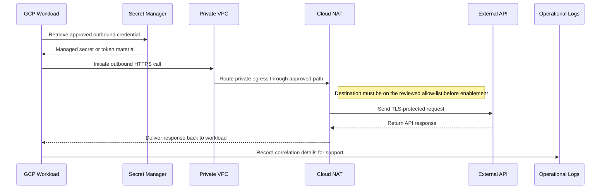
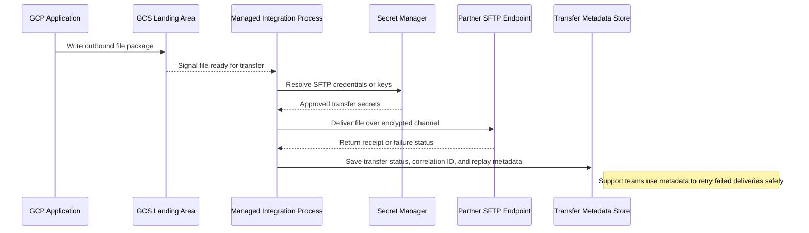
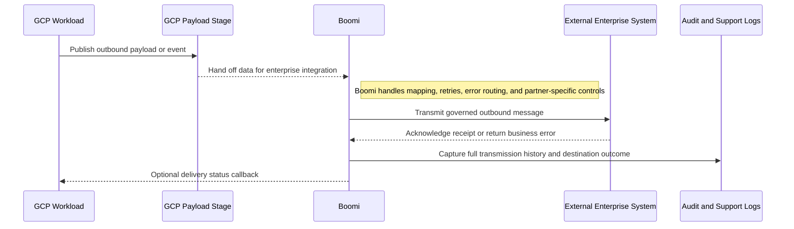

# Integration Reference Architecture — GCP Egress Patterns

## GCP Egress Patterns

**Version:** 0.1
**Status:** Draft – Pending Architecture Review
**Audience:** Solution Architects, Integration Engineers, Security and Operations Teams

---

## Document Introduction

### Purpose of Document

This document defines approved patterns for outbound data and integration traffic leaving Entegris workloads on GCP. It helps teams choose a controlled egress path that aligns with data classification, network policy, and external integration standards.

- The value of the pattern is speed to execution — leveraging what others have done before and quickly achieving business outcomes
- A pattern is best expressed as: When to use, When Not to use certain technologies/approaches
- This document is for designers and architects who need to send data or requests from GCP to external systems without bypassing Entegris integration controls
- If implemented properly, these patterns enable you to get to production as fast as possible and have the most stable, scalable, and maintenance-free set of applications possible

### Scope and Applicability

These patterns cover outbound API, file, and mediated integration flows from GCP-hosted services to destinations outside the local platform boundary.

- Outbound API requests and partner file exchanges from GCP-managed workloads
- Brokered integration through Boomi for external enterprise system connectivity

**Environments:**

- Cloud
- Hybrid

### Intended Audience

- Solution Architects
- Integration Engineers
- Application Developers
- Security and Operations Teams

---

## Context

- Private GCP resources use Cloud NAT or approved private connectivity for outbound internet access
- VPC Service Controls and network policy should constrain egress to approved services and destinations
- Data classification checks are mandatory before egressing PII, financial, or otherwise regulated information
- External system integration flows are standardized through Boomi rather than direct application-managed connections

### Why Use These Patterns

- Reduce cost through consolidation of functionality
- Agility through solutions based on a set of services that supports restructuring and reconfiguration of business processes
- Time-to-market through business-aligned solutions
- Alignment between IT and business goals, enabling re-use over time

---

## Architecture Principles

### Enterprise Principles

- Loosely Coupled and Interoperable Solutions
- Remove Friction
- Keep It Simple

### Domain-Specific Principles

- Internet and API First
- Observability and Reliability by Design
- Integration Through Standard Middleware

### Security Principles

- Security and Privacy by Design
- Defense in Depth
- Security Assurance Through Least Privilege

---

## High-Level Solution Patterns

| Solution | When to Use | When Not to Use |
|---|---|---|
| API Egress |• Need an approved outbound HTTPS call from a GCP-hosted service • Destination is a controlled external API with defined contract and low complexity|• The flow is an enterprise system integration better owned in Boomi • The destination lacks approved security controls or data classification clearance|
| File Egress |• Need scheduled or event-driven delivery to SFTP or partner file exchange • Payloads are file-oriented and contractually defined|• The integration needs near-real-time API semantics • A direct application-managed file transfer would bypass enterprise integration governance|
| Boomi-mediated Egress |• GCP service needs to integrate with a complex external system • Boomi provides orchestration value through centralized retry, mapping, and partner controls|• The use case is a simple internal-only call that does not leave the platform boundary • The team expects to hardcode destination integration logic inside an app|

---

## Pattern Selection Matrix

| Scenario Cue | Destination Type | Data Classification | Direction | Recommended Pattern | Notes |
| --- | --- | --- | --- | --- | --- |
| Approved SaaS status API lookup | External API | Low to moderate | GCP → External API | API Egress | Use Cloud NAT with static IPs for IP allowlisting by external partners; store external API keys in GCP Secret Manager with 90-day rotation |
| Nightly partner file handoff | SFTP or managed file exchange | Moderate to high | GCP → Partner | File Egress | Encrypt all files with customer-managed Cloud KMS keys before SFTP transfer |
| Outbound master-data sync to external enterprise system | Enterprise application | Sensitive or regulated | GCP → External System | Boomi-mediated Egress | Use Boomi when target system requires complex authentication, retry, or scheduling logic |

---

## Canonical Patterns

### API Egress

| Area | Description |
|---|---|
| **Context** | A GCP-hosted workload needs to call an approved external API to complete a business process. The traffic originates from private resources that still require controlled outbound internet access. |
| **Problem** | How do we let a GCP workload call an external API without opening unmanaged egress paths or skipping security review? |
| **Solution** | • Route outbound traffic through Cloud NAT or approved private connectivity from the VPC hosting the workload • Validate the destination against data-classification and network allow-list requirements before enabling the integration • Use TLS and managed secrets for credentials while logging outbound correlation details for operational support |
| **Benefits** | • Provides a controlled pattern for low-complexity outbound API use cases • Keeps private workloads private while still allowing approved external calls • Supports centralized monitoring and policy enforcement on outbound traffic |
| **Considerations** | • External system integrations should move to Boomi when orchestration, mapping, or partner governance is needed • VPC Service Controls and firewall policy must be kept aligned with approved destinations |

### File Egress

| Area | Description |
|---|---|
| **Context** | A business process requires file delivery from GCP to a partner or service that expects SFTP or managed file exchange. The payload is file-centric rather than request-reply API traffic. |
| **Problem** | How do we deliver outbound files securely and repeatably without pushing file-transfer logic into individual applications? |
| **Solution** | • Prepare the outbound file in an approved GCP landing area and initiate transfer through a managed integration process • Use encrypted transport such as SFTP with credentials or keys managed through approved secret handling controls • Record transfer status, correlation IDs, and replay metadata so failed deliveries can be retried safely |
| **Benefits** | • Supports common partner exchange patterns with clear operational checkpoints • Improves supportability for retries, acknowledgements, and audit needs • Separates file packaging concerns from application runtime logic |
| **Considerations** | • File formats and encryption expectations must be contractually defined with the receiver • Sensitive outbound files may require additional approval, masking, or retention controls before transfer |

### Boomi-mediated Egress

| Area | Description |
|---|---|
| **Context** | A GCP workload needs to send data to an external enterprise system where mappings, retries, and operational governance matter. The flow is an integration concern rather than a simple application HTTP call. |
| **Problem** | How do we standardize outbound external integrations so application teams do not build one-off connectivity and error handling? |
| **Solution** | • Publish or stage the outbound payload from GCP and hand off the integration to Boomi for protocol handling and orchestration • Use Boomi to apply retries, mapping, error routing, and partner-specific controls before transmitting to the destination system • Enforce TLS, approved credentials, and destination governance while capturing full audit and support metadata |
| **Benefits** | • Aligns outbound enterprise integrations to the Entegris middleware standard • Centralizes connectivity, monitoring, and replay controls in one platform • Reduces custom egress code in applications and improves maintainability |
| **Considerations** | • Application teams should not bypass Boomi for external system integration just to reduce short-term implementation effort • Destination SLAs and payload contracts still need explicit ownership between business and integration teams |

## Sequence Diagrams

### API Egress Flow

### File Egress Flow

### Boomi-mediated Egress Flow

---

## Tips and Best Practices

- Use Cloud NAT for egress traffic from private GCE/GKE instances
- Store external API credentials in GCP Secret Manager with automatic rotation
- Log all egress API calls to Cloud Logging with correlation_id and external_system tags
- Use Boomi for orchestration when target systems require complex retry or scheduling logic
- Implement circuit breakers in Cloud Run services calling flaky external APIs
