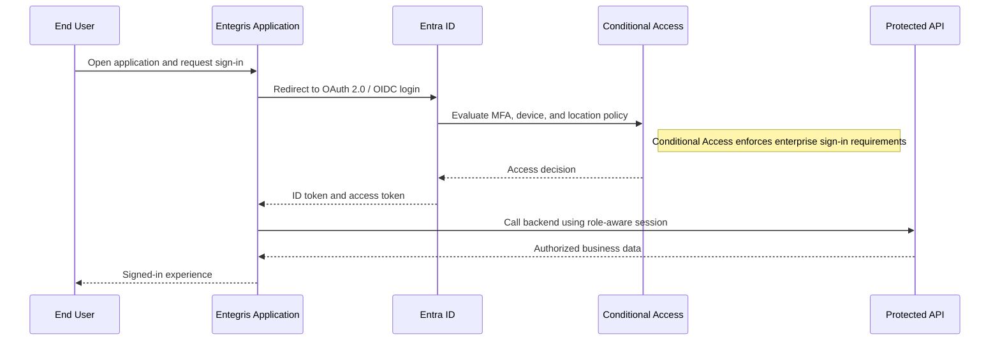
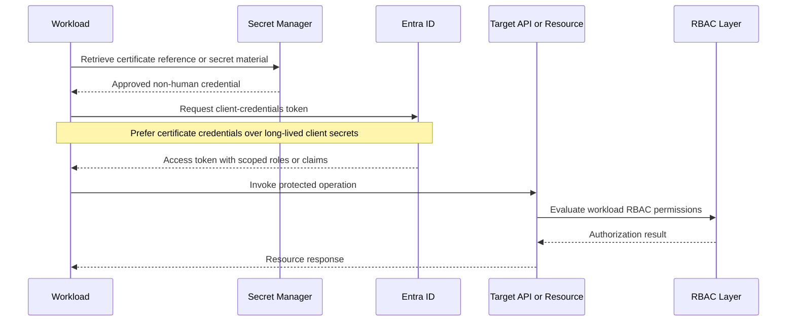
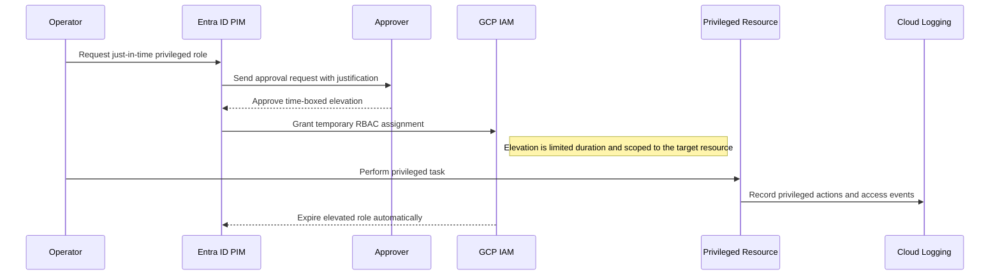

# Reference Architecture — Access & Authorization Management Patterns

## Access and Authorization Management Patterns

**Version:** 0.1
**Status:** Draft – Pending Architecture Review
**Audience:** Solution Architects, Integration Engineers, Security and Operations Teams

---

## Document Introduction

### Purpose of Document

This document defines approved identity and authorization patterns for Entegris applications, APIs, and privileged operations. It helps teams separate human, machine, and elevated access in a way that is secure, reviewable, and scalable.

- The value of the pattern is speed to execution — leveraging what others have done before and quickly achieving business outcomes
- A pattern is best expressed as: When to use, When Not to use certain technologies/approaches
- This document is for designers and architects who need to apply the right identity, authentication, and authorization model for users, services, and administrators
- If implemented properly, these patterns enable you to get to production as fast as possible and have the most stable, scalable, and maintenance-free set of applications possible

### Scope and Applicability

These patterns cover human authentication, machine-to-machine authorization, and privileged access control across the Entegris technology estate.

- User sign-in and delegated access using Microsoft Entra ID and modern identity protocols
- Service identities, privileged elevation, and role-based access for cloud and application resources

**Environments:**

- Cloud
- Hybrid
- SaaS

### Intended Audience

- Solution Architects
- Application Developers
- Security Engineers
- Operations Teams

---

## Context

- Microsoft Entra ID is the single enterprise identity provider for Entegris systems
- Conditional Access policies apply to all human access and enforce controls such as MFA, compliant device, and location checks
- Machine automation must use service principals with client credentials and never rely on user accounts
- Certificate credentials are preferred over client secrets for non-user identities

### Why Use These Patterns

- Reduce cost through consolidation of functionality
- Agility through solutions based on a set of services that supports restructuring and reconfiguration of business processes
- Time-to-market through business-aligned solutions
- Alignment between IT and business goals, enabling re-use over time

---

## Architecture Principles

### Enterprise Principles

- Demonstrate Trustworthiness and Stewardship
- Keep It Simple
- Solutions Are Democratized

### Domain-Specific Principles

- Applications Expose Stable, Documented Interfaces
- Self-Service Focus

### Security Principles

- Security and Privacy by Design
- Security Assurance Through Least Privilege
- Trust Through Transparency

---

## High-Level Solution Patterns

| Solution | When to Use | When Not to Use |
|---|---|---|
| Human User Authentication Pattern |• Need user sign-in for applications or portals • Require Conditional Access and standards-based federation|• The caller is an automated system or daemon • Teams plan to embed local credentials outside Entra ID|
| Machine-to-Machine (M2M) Pattern |• Need non-interactive service access to APIs or integrations • Automation must not depend on a personal account|• A human interactive sign-in is required • The integration cannot safely manage non-user credentials|
| Privileged Access Pattern |• Need temporary elevated rights for administration or break-fix support • Approval and audit are mandatory|• The task can be performed with normal operational roles • Teams expect permanent high-privilege access for convenience|

---

## Pattern Selection Matrix

| Scenario Cue | Access Type | Credential Model | Direction | Recommended Pattern | Notes |
| --- | --- | --- | --- | --- | --- |
| Employee signs into an internal app | Human interactive | Entra ID OAuth 2.0/OIDC | User → App | Human User Authentication Pattern | Use Identity-Aware Proxy (IAP) for internal web apps requiring Entegris SSO |
| Backend service calls an internal API | Machine-to-machine | Service principal client credentials | Service → API | Machine-to-Machine (M2M) Pattern | Store service principal credentials in GCP Secret Manager, never in code or environment variables |
| Admin needs temporary production access | Privileged elevated | Approved time-limited entitlement | Admin → Platform | Privileged Access Pattern | Use CyberArk for privileged access with approval workflow; all actions logged to SIEM |

---

## Canonical Patterns

### Human User Authentication Pattern

| Area | Description |
|---|---|
| **Context** | A user must sign in to an Entegris application or web experience using enterprise identity. The application needs a consistent sign-in experience and centralized policy enforcement. |
| **Problem** | How do we authenticate human users in a way that aligns with Entra ID, Conditional Access, and application role governance? |
| **Solution** | • Authenticate users through Entra ID using OAuth 2.0/OIDC flows with Conditional Access policies enforcing MFA, device compliance, and location requirements • Map application authorization to roles or groups rather than bespoke local credential stores |
| **Benefits** | • Centralizes human identity and authentication policy in one enterprise control plane • Improves user experience and reduces duplicate credential stores • Supports stronger security through Conditional Access and centralized review |
| **Considerations** | • Application teams must distinguish authentication from downstream authorization decisions • Local fallback accounts should be avoided unless a documented exception exists |

### Machine-to-Machine (M2M) Pattern

| Area | Description |
|---|---|
| **Context** | A service, integration, or daemon needs to call another system without user interaction. The flow must be durable, secure, and independent of employee lifecycle events. |
| **Problem** | How do we authorize automation safely without using personal accounts or interactive sign-in patterns? |
| **Solution** | • Register a service principal in Entra ID and use the client credentials grant for non-interactive access • Prefer certificate credentials over client secrets and scope permissions to the minimum required API roles or claims • Use the resulting identity to access APIs or resources under RBAC controls appropriate to the workload |
| **Benefits** | • Separates automation identity from human users and their lifecycle events • Supports strong least-privilege access with narrow scopes and roles • Improves auditability of machine actions across APIs and cloud resources |
| **Considerations** | • Quarterly access reviews are required for service principal permissions • Credential rotation and certificate renewal must be built into operating procedures |

### Privileged Access Pattern

| Area | Description |
|---|---|
| **Context** | An operator or administrator occasionally needs elevated rights to perform support or administration work. Standing broad access would create unnecessary risk. |
| **Problem** | How do we grant privileged access only when needed and still preserve accountability for high-risk actions? |
| **Solution** | • Use an approval-based just-in-time elevation process that grants privileged access for a limited duration only • Assign elevated rights through RBAC at the appropriate resource scope rather than broad permanent user grants • Log all privileged actions to Cloud Logging and review access records on a defined cadence |
| **Benefits** | • Reduces the attack surface created by always-on privileged accounts • Creates an auditable record of who elevated access and why • Aligns high-risk operations with approval and oversight processes |
| **Considerations** | • Emergency access paths still need logging, time limits, and post-use review • Privileged workflows must be simple enough that teams do not try to bypass them under pressure |

## Sequence Diagrams

### Human User Authentication Pattern Flow

### Machine-to-Machine (M2M) Pattern Flow

### Privileged Access Pattern Flow

---

## Tips and Best Practices

- Use Identity-Aware Proxy (IAP) for all internal web apps requiring Entegris SSO
- Store OAuth client secrets in GCP Secret Manager, never in application code
- Log all authentication events to Cloud Logging with user_email and access_decision tags
- Implement least privilege IAM roles; never grant Owner or Editor roles to service accounts
- Use GCP Organization Policy constraints to enforce IAM guardrails across all projects
