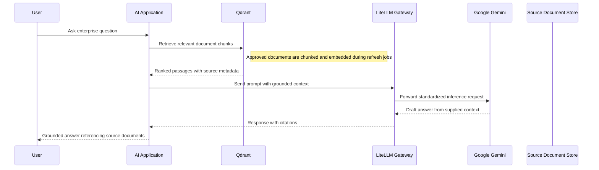
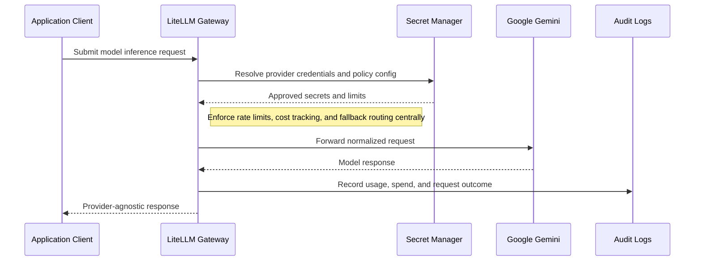
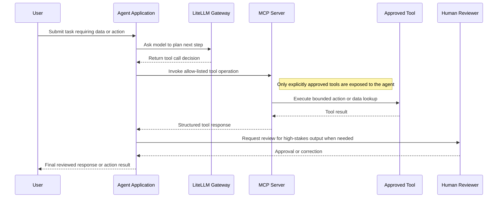

# AI Architecture Patterns

## AI Architecture Patterns

**Version:** 0.1
**Status:** Draft – Pending Architecture Review
**Audience:** Solution Architects, Integration Engineers, Security and Operations Teams

---

## Document Introduction

### Purpose of Document

This document defines approved patterns for AI and LLM-enabled solutions at Entegris. It helps teams use the enterprise AI gateway, grounded retrieval, and controlled agent behaviors without bypassing governance.

- The value of the pattern is speed to execution — leveraging what others have done before and quickly achieving business outcomes
- A pattern is best expressed as: When to use, When Not to use certain technologies/approaches
- This document is for designers and architects who need to design AI solutions that are grounded, auditable, and aligned to Entegris platform standards
- If implemented properly, these patterns enable you to get to production as fast as possible and have the most stable, scalable, and maintenance-free set of applications possible

### Scope and Applicability

These patterns cover LLM gateway usage, retrieval-augmented generation, and tool-calling agents for enterprise AI solutions.

- Application and service integration with LLM capabilities through the enterprise LiteLLM gateway
- Grounded retrieval and agentic patterns that require tool access and governance

**Environments:**

- Cloud

### Intended Audience

- Solution Architects
- Application Developers
- Data Engineers
- Security and Operations Teams

---

## Context

- All AI and LLM API calls must route through LiteLLM; direct model provider calls are not approved
- Google Gemini is the primary model family and is accessed through the LiteLLM gateway
- Grounding, citations, and output validation are mandatory when responses influence business or compliance decisions
- Prompt templates and agent configurations must be version-controlled in GitHub rather than hardcoded in application logic

### Why Use These Patterns

- Reduce cost through consolidation of functionality
- Agility through solutions based on a set of services that supports restructuring and reconfiguration of business processes
- Time-to-market through business-aligned solutions
- Alignment between IT and business goals, enabling re-use over time

---

## Architecture Principles

### Enterprise Principles

- Demonstrate Trustworthiness and Stewardship
- Keep It Simple
- Think Big and Execute Rapidly

### Domain-Specific Principles

- Human Accountability for AI Decisions
- Trusted Data for Trusted AI
- Responsible and Fair AI Use

### Security Principles

- Security and Privacy by Design for AI
- Trust Through Data Stewardship
- Security Assurance Through Least Privilege

---

## High-Level Solution Patterns

| Solution | When to Use | When Not to Use |
|---|---|---|
| RAG Pattern |• Need answers grounded in Entegris documents or enterprise knowledge • Retrieved evidence must shape the model response|• The use case does not depend on enterprise knowledge retrieval • Teams cannot maintain document chunking, embedding, and freshness pipelines|
| LLM API Gateway Pattern |• Need any application or service to call an LLM • Cost tracking, rate limiting, and audit logging are required|• Teams intend to call model providers directly • The solution does not require LLM capabilities at all|
| AI Agent with Tool-Calling Pattern |• Need the model to perform bounded actions through approved tools • Workflows require orchestration across systems or data sources|• A simple retrieval or text generation pattern is sufficient • Tool scope cannot be constrained or validated safely|

---

## Pattern Selection Matrix

| Scenario Cue | Knowledge Source | Risk Level | Direction | Recommended Pattern | Notes |
| --- | --- | --- | --- | --- | --- |
| Question answering over enterprise documents | Curated internal content | Moderate to high | User → AI service | RAG Pattern | Use Qdrant for vector retrieval with DLP scanning on ingested documents; log all queries and responses to BigQuery for audit |
| New app feature needs model inference | Prompt only or external context | Moderate | App → LiteLLM → Model | LLM API Gateway Pattern | Route through LiteLLM to enforce rate limits, content filtering, and PII redaction policies |
| Workflow assistant needs approved actions | Enterprise data plus tool access | High | User → Agent → MCP tools | AI Agent with Tool-Calling Pattern | Implement human-in-the-loop approval for write operations; log all tool calls to Cloud Logging |

---

## Canonical Patterns

### RAG Pattern

| Area | Description |
|---|---|
| **Context** | Users need AI-generated answers grounded in enterprise documents rather than unsupported model memory. Source content changes over time and must be cited back to the user. |
| **Problem** | How do we generate useful answers from enterprise knowledge while reducing hallucination risk and preserving traceability? |
| **Solution** | • Chunk approved documents, create embeddings, and store them in Qdrant as the vector retrieval layer • At query time retrieve relevant passages, pass them through LiteLLM to Google Gemini, and instruct the model to synthesize only from grounded context • Return citations to the source documents and validate outputs before presenting them to the user |
| **Benefits** | • Improves answer relevance by grounding responses in enterprise content • Supports explainability through citations and retained source context • Separates knowledge refresh from prompt or application deployment cycles |
| **Considerations** | • Document chunking, metadata, and refresh processes are critical to retrieval quality • Sensitive sources need access control and classification-aware retrieval filters |

### LLM API Gateway Pattern

| Area | Description |
|---|---|
| **Context** | Multiple applications need model access, but Entegris requires common controls for routing, spend, and observability. The organization wants one enterprise point of policy enforcement. |
| **Problem** | How do we let teams use LLMs without creating uncontrolled direct dependencies on model providers? |
| **Solution** | • Send every inference request through the LiteLLM gateway rather than direct model provider SDKs or APIs • Use LiteLLM capabilities for unified API shape, rate limiting, cost tracking, fallback routing, and audit logging • Connect the gateway to approved upstream models such as Google Gemini and keep application code provider-agnostic |
| **Benefits** | • Centralizes AI policy enforcement and provider management • Reduces application coupling to a single model vendor or API shape • Improves visibility into spend, usage, and operational issues |
| **Considerations** | • Gateway availability and configuration become a shared platform dependency • Application teams still need prompt and output design discipline even with a managed gateway |

### AI Agent with Tool-Calling Pattern

| Area | Description |
|---|---|
| **Context** | An AI solution needs to do more than answer text questions and must invoke tools to gather data or take approved actions. The workflow carries higher operational and compliance risk than plain generation. |
| **Problem** | How do we enable agentic behavior while keeping tool use bounded, reviewable, and safe? |
| **Solution** | • Define tool access through MCP with an explicit allow-list of operations the agent is permitted to call • Route model requests through LiteLLM and validate outputs before any user-facing response or action is completed • Insert human review checkpoints for high-stakes outputs such as architecture advice, compliance guidance, or irreversible actions |
| **Benefits** | • Enables richer automation while preserving control over what the agent can access • Improves supportability through explicit tool scopes and audit logs • Allows human oversight where risk or ambiguity is high |
| **Considerations** | • Tool schemas, permissions, and side effects must be designed carefully before production use • Agents should not be given broader scope than the narrow business workflow requires |

## Sequence Diagrams

### RAG Pattern Flow

### LLM API Gateway Pattern Flow

### AI Agent with Tool-Calling Pattern Flow

---

## Tips and Best Practices

- Store AI model artifacts in GCS with versioning enabled and DLP scanning for PII leakage
- Use Vertex AI Model Registry for all production models with approval workflow before deployment
- Log all model predictions to BigQuery with model_version, input_features, and prediction_confidence
- Implement A/B testing for new model versions using Cloud Run traffic splitting
- Monitor model drift weekly using Vertex AI Model Monitoring; retrain when accuracy drops >5%
