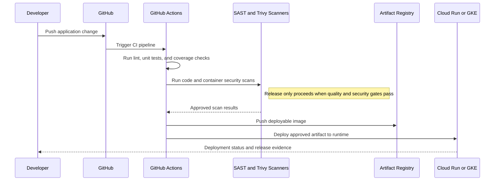
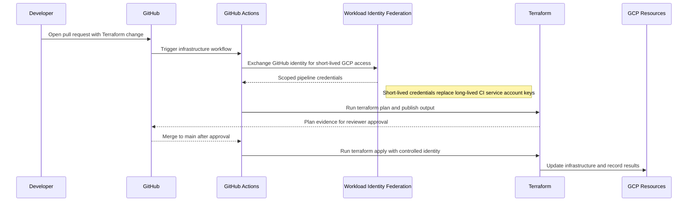
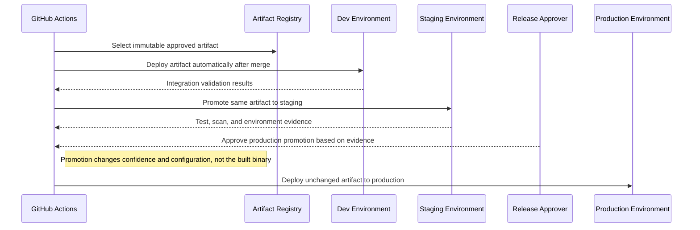

# Reference Architecture — DevOps & CI/CD Pipeline Patterns

## DevOps and CI/CD Pipeline Patterns

**Version:** 0.1
**Status:** Draft – Pending Architecture Review
**Audience:** Solution Architects, Integration Engineers, Security and Operations Teams

---

## Document Introduction

### Purpose of Document

This document defines approved CI/CD patterns for delivering Entegris applications and infrastructure. It helps teams standardize on GitHub Actions, secure pipeline credentials, and controlled environment promotion.

- The value of the pattern is speed to execution — leveraging what others have done before and quickly achieving business outcomes
- A pattern is best expressed as: When to use, When Not to use certain technologies/approaches
- This document is for designers and architects who need to deliver code and infrastructure changes through repeatable pipelines that embed quality, security, and release governance
- If implemented properly, these patterns enable you to get to production as fast as possible and have the most stable, scalable, and maintenance-free set of applications possible

### Scope and Applicability

These patterns cover application delivery, infrastructure-as-code delivery, and release promotion through Entegris-standard pipelines.

- Application build, test, scan, and deployment pipelines implemented in GitHub Actions
- Terraform plan/apply workflows and gated environment promotion for production delivery

**Environments:**

- Cloud
- Hybrid

### Intended Audience

- Solution Architects
- DevOps Engineers
- Application Developers
- Security and Operations Teams

---

## Context

- GitHub Actions is the standard CI/CD platform and should be used for both applications and infrastructure
- Feature branches, pull requests, and a protected main branch are the expected branch strategy baseline
- Pipelines must include linting, unit testing, build, container security scanning, and deployment steps appropriate to the workload
- Secrets should be accessed through GCP Secret Manager and Workload Identity Federation rather than long-lived service account keys

### Why Use These Patterns

- Reduce cost through consolidation of functionality
- Agility through solutions based on a set of services that supports restructuring and reconfiguration of business processes
- Time-to-market through business-aligned solutions
- Alignment between IT and business goals, enabling re-use over time

---

## Architecture Principles

### Enterprise Principles

- Think Big and Execute Rapidly
- Keep It Simple
- Automate Where Possible

### Domain-Specific Principles

- Cloud-Native Application Design
- Observability and Reliability by Design
- Architecture Governance Through ARB and TRB

### Security Principles

- Security and Privacy by Design
- Security Assurance Through Least Privilege
- Defense in Depth

---

## High-Level Solution Patterns

| Solution | When to Use | When Not to Use |
|---|---|---|
| Application CI/CD Pattern |• Need to build, test, scan, and deploy an application artifact • Container or application release must be automated end to end|• The change is purely infrastructure code with no application artifact • Teams plan to release manually outside GitHub Actions|
| Infrastructure CI/CD Pattern |• Need Terraform plan on PR and apply on merge • Infrastructure changes require the same governance as application code|• Teams expect to run infrastructure changes only from local machines • The change is a runtime configuration value that belongs in app deployment|
| Release Promotion Pattern |• Need dev to staging to prod progression with approvals • Different environments have different risk and validation needs|• Every deployment goes directly to production • There is no environment separation or approval process|

---

## Pattern Selection Matrix

| Scenario Cue | Delivery Type | Trigger | Direction | Recommended Pattern | Notes |
| --- | --- | --- | --- | --- | --- |
| Application code merged after PR review | Application artifact delivery | PR then merge to main | GitHub → Runtime | Application CI/CD Pattern | Use Cloud Build for container builds; integrate Snyk for vulnerability scanning before deploy |
| Terraform change proposed in pull request | Infrastructure delivery | PR for plan, merge for apply | GitHub → Terraform → Cloud | Infrastructure CI/CD Pattern | Run terraform plan on every PR; require approval before merge; apply only from main branch |
| Promoting approved release to production | Environment promotion | Post-staging validation with approval | Dev → Staging → Prod | Release Promotion Pattern | Use Cloud Deploy for progressive delivery with automated rollback on failed health checks |

---

## Canonical Patterns

### Application CI/CD Pattern

| Area | Description |
|---|---|
| **Context** | An application change must move from source control to a deployable runtime artifact through an automated path. Quality and security checks are part of the release definition, not optional extras. |
| **Problem** | How do we ship application changes consistently while ensuring testing, scanning, and deployment steps always run? |
| **Solution** | • Use GitHub Actions to run linting, unit tests, coverage checks, build steps, and container creation for every relevant change • Run security controls such as SAST and Trivy container scanning before pushing images to Artifact Registry or releasing to production environments • Deploy the approved artifact to Cloud Run or GKE through the same pipeline with environment-specific promotion controls |
| **Benefits** | • Creates one repeatable release path from code change to deployed workload • Improves quality by enforcing checks on every change rather than relying on manual discipline • Makes released artifacts traceable back to source control and pipeline evidence |
| **Considerations** | • Pipelines should remain fast enough that teams do not try to bypass them • Coverage thresholds and scans need calibration so they are meaningful and not merely ceremonial |

### Infrastructure CI/CD Pattern

| Area | Description |
|---|---|
| **Context** | Infrastructure changes need the same review and automated execution discipline as application changes. Teams want safe plan visibility before any apply occurs. |
| **Problem** | How do we deliver Terraform changes through source control and pipelines without reintroducing manual infrastructure drift? |
| **Solution** | • Run Terraform plan in GitHub Actions for pull requests and publish the output for review before merge • Run Terraform apply only after merge to main through a controlled pipeline identity using Workload Identity Federation • Schedule recurring Terraform plan runs to detect and investigate drift from any manual cloud changes |
| **Benefits** | • Improves transparency and confidence in infrastructure changes before they are applied • Reduces manual drift and strengthens auditability • Aligns infrastructure operations with the broader Entegris delivery model |
| **Considerations** | • Pipeline permissions must be tightly scoped because apply steps can change production infrastructure • Plan output should be understandable enough for reviewers to spot destructive or surprising changes quickly |

### Release Promotion Pattern

| Area | Description |
|---|---|
| **Context** | A change has passed build and test gates and now needs controlled movement through dev, staging, and production. Different environments have different validation and approval expectations. |
| **Problem** | How do we promote releases across environments without turning every deployment into a manual snowflake process? |
| **Solution** | • Deploy automatically to lower environments after merge so integration issues are found early • Use staged approvals and evidence from tests, scans, and environment validation before promoting to production • Keep the same artifact across environments so promotion is about confidence and configuration, not rebuilding different binaries |
| **Benefits** | • Creates a predictable release motion across teams and products • Improves production confidence by gating promotion on real evidence • Reduces release risk through consistency and clear approval points |
| **Considerations** | • Environment parity matters; promotion loses value when staging differs materially from production • Approval gates must have clear owners or they become delivery bottlenecks |

## Sequence Diagrams

### Application CI/CD Pattern Flow

### Infrastructure CI/CD Pattern Flow

### Release Promotion Pattern Flow

---

## Tips and Best Practices

- Store all CI/CD secrets in GCP Secret Manager, never in GitHub Actions environment variables
- Use Cloud Build for container builds; integrate Snyk for vulnerability scanning before deploy
- Log all deployment events to Cloud Logging with commit_sha and deployer_email tags
- Implement automated rollback in Cloud Deploy for failed health checks within 5 minutes
- Use separate GCP projects for Dev, Test, and Prod with enforced IAM boundaries
