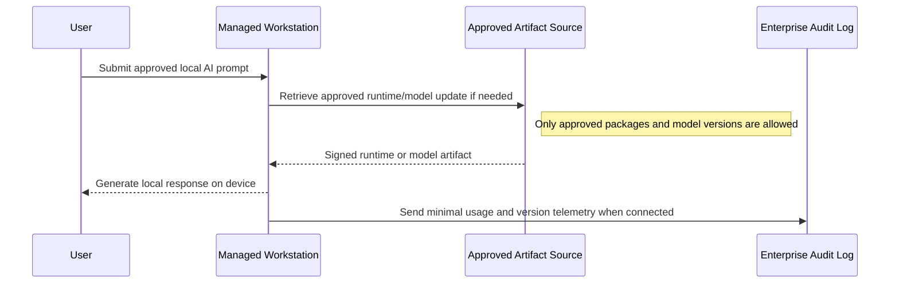
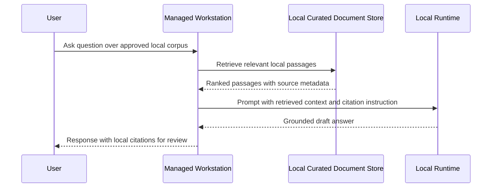
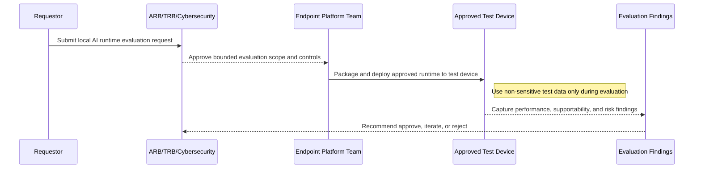

# Reference Architecture — Local AI Patterns

## Local AI Patterns

**Version:** 0.1
**Status:** Draft – Candidate for ARB/TRB Review
**Audience:** Solution Architects, Application Engineers, Security, End User Computing, and Operations Teams

---

## Document Introduction

### Purpose of Document

This document defines an initial Entegris pattern for running approved local AI capabilities on managed workstations. It provides a documented position for cases where teams need on-device inference, offline experimentation, or local document processing without immediately standing up a cloud-hosted AI service.

- The value of the pattern is speed to execution — leveraging what others have done before and quickly achieving business outcomes
- A pattern is best expressed as: When to use, When Not to use certain technologies/approaches
- This document is for designers and architects who need to evaluate whether local AI on a managed endpoint is appropriate and what controls are required before it is allowed
- If implemented properly, these patterns enable teams to iterate safely while preserving governance, supportability, and data protection

### Scope and Applicability

These patterns cover local AI runtimes and models executed on Entegris-managed workstations for development, research, summarization, and bounded knowledge tasks.

- Local model inference on a managed laptop, workstation, or approved engineering desktop
- Optional local document retrieval over approved, non-restricted content sets stored on the same device
- Controlled synchronization of prompts, configurations, logs, and approved artifacts back to enterprise systems when connectivity exists

**Environments:**

- Local workstation
- Corporate desktop
- Isolated development environment

### Intended Audience

- Solution Architects
- Application Developers
- Data and AI Engineers
- Cybersecurity and Risk Teams
- End User Computing / Platform Engineering

---

## Context

- The AI Policy allows work-related AI use only through authorized AI tools and requires new tools to go through review before use
- Teams may need local AI because software download restrictions, network constraints, offline work, or data-handling concerns make immediate use of a cloud AI service impractical
- Local AI reduces external data transfer but introduces endpoint governance, model provenance, patching, and auditability concerns
- Human review remains mandatory for outputs that influence business, compliance, quality, safety, or customer outcomes
- Confidential Restricted data must not be processed in local AI tools unless an explicit exception and legal review are in place

### Why Use These Patterns

- Reduce experimentation friction for approved internal use cases
- Support low-latency or partially offline workflows on managed devices
- Keep early exploration documented so the organization can iterate toward a supported standard
- Provide a governed alternative to unmanaged public or personal AI tools

---

## Architecture Principles

### Enterprise Principles

- Keep It Simple
- Think Big and Execute Rapidly
- Reuse Shared Application Services First

### Domain-Specific Principles

- AI Decisions Must Be Explainable
- Responsible AI Must Be Embedded in Design
- Humans in the Loop for Material Decisions
- Avoid AI Where Rules Suffice

### Security Principles

- Security and Privacy by Design
- Trust Through Data Stewardship
- Security Assurance Through Least Privilege
- Defense in Depth

---

## Guardrail Summary

This pattern is constrained by the following knowledge base guidance:

- The AI Policy requires any local AI runtime to be an authorized AI tool before business use
- Confidential Restricted data must not be entered into local AI tools
- Human review is mandatory before AI output is used for consequential business decisions or external communication
- Prompt, output, and local knowledge retention should be minimized and automatically deleted where feasible
- Endpoint controls such as disk encryption, malware protection, patching, and device management are part of the solution design, not afterthoughts

---

## High-Level Solution Patterns

| Solution | When to Use | When Not to Use |
|---|---|---|
| Local AI Workstation Pattern |• Need approved local inference on a managed endpoint • Need rapid prototyping, summarization, coding assistance, or document analysis without dependence on a constant cloud connection • Data can be limited to public, internal, or approved confidential non-restricted content|• The use case requires production-grade scale, centralized governance, or shared enterprise access • The data includes Confidential Restricted content • The endpoint cannot be managed to enterprise security standards|
| Local AI with Local RAG Pattern |• Need answers grounded in a small approved corpus stored locally on the device • Need citations or traceability for engineering, policy, or support tasks while offline or semi-connected|• The corpus is large, fast-changing, or needs centralized freshness management • Access must be shared across many users or roles • Retrieval must span systems of record that should remain server-side|
| Local AI Experiment Sandbox Pattern |• Need a time-boxed evaluation of a local model runtime such as Ollama on a corporate device • Architects want a documented pattern before deciding whether to standardize the runtime|• Users want to bypass software controls with personal accounts, side-loading, or unmanaged plugins • The intent is to support unattended production automation or agentic actions without review|

---

## Pattern Selection Matrix

| Scenario Cue | Connectivity | Data Sensitivity | Primary Need | Recommended Pattern | Notes |
| --- | --- | --- | --- | --- | --- |
| Developer needs local coding or summarization help on a managed laptop | Connected or intermittent | Public / Internal / approved Confidential | Fast personal productivity | Local AI Workstation Pattern | Start with a documented approved runtime and model allow-list; do not permit arbitrary model pulls |
| Engineer needs local question answering over a small approved document set | Intermittent or offline | Public / Internal / approved Confidential | Grounded answers with citations | Local AI with Local RAG Pattern | Keep the corpus curated and stored locally with device encryption; retain source metadata for traceability |
| Team wants to evaluate whether Ollama is viable in the enterprise | Connected during setup, optional offline use later | Non-sensitive test data only | Architecture evaluation | Local AI Experiment Sandbox Pattern | Time-box the evaluation, document risks, and route approval through ARB/TRB and Cybersecurity |
| Department wants a shared assistant for many users | Connected | Mixed enterprise data | Multi-user service | Use cloud AI patterns instead | Move to LiteLLM gateway and centralized controls rather than distributing models endpoint-by-endpoint |

---

## Canonical Patterns

### Local AI Workstation Pattern

| Area | Description |
|---|---|
| **Context** | A user or small team needs AI assistance directly on a managed workstation because local execution offers lower friction, lower latency, or reduced external data movement for an approved use case. |
| **Problem** | How do we enable local AI on corporate endpoints without creating an unmanaged shadow AI footprint or bypassing enterprise governance? |
| **Solution** | • Package and approve a local AI runtime, model set, and installation method through standard enterprise review channels before business use • Run only on managed devices with disk encryption, endpoint protection, OS patching, and least-privilege installation controls • Restrict usage to approved prompts and data classes, require human review of outputs, and synchronize minimal audit events to enterprise logging when feasible • Treat model files and prompt templates as versioned artifacts with documented provenance and ownership |
| **Benefits** | • Enables rapid local experimentation and user productivity without dependence on constant cloud access • Reduces uncontrolled use of public AI tools by offering a governed local alternative • Keeps data processing closer to the user for approved low-risk workflows |
| **Considerations** | • Endpoint-by-endpoint deployment increases operational support effort compared with a centralized service • Model downloads, updates, and hardware requirements must be governed explicitly • Local execution does not remove the need for policy, logging, and review controls |

### Local AI with Local RAG Pattern

| Area | Description |
|---|---|
| **Context** | A user needs local AI answers grounded in a bounded set of approved documents, for example architecture guidance, technical references, or working notes that can be stored on the same device. |
| **Problem** | How do we provide grounded local answers while preserving traceability and avoiding a fragile, oversized local knowledge base? |
| **Solution** | • Store only an approved, curated document subset on the device and generate embeddings locally or through a controlled pre-processing step • Retrieve local passages at query time and require the model to answer from retrieved context with source references • Enforce data minimization, local encryption, retention limits, and removal of stale or unapproved documents from the device |
| **Benefits** | • Improves answer quality compared with prompt-only local inference • Supports explainability through local citations and grounded context • Works when network access is limited or disconnected |
| **Considerations** | • Local corpora drift quickly if ownership and refresh processes are unclear • Sensitive or broadly shared knowledge sources are usually better served by centralized RAG patterns |

### Local AI Experiment Sandbox Pattern

| Area | Description |
|---|---|
| **Context** | The organization wants to evaluate a local AI runtime such as Ollama, but the runtime is not yet a broadly established enterprise standard and installation may currently be blocked by endpoint controls. |
| **Problem** | How do we evaluate a blocked or not-yet-standard local AI runtime without encouraging policy bypass or ungoverned experimentation? |
| **Solution** | • Treat the runtime as a candidate authorized AI tool and document the evaluation scope, owner, approved devices, approved models, and exit criteria before installation • Use only non-sensitive test prompts and datasets during the evaluation unless broader approval is explicitly granted • Route software packaging, endpoint exceptions, risk review, and architecture approval through normal ARB/TRB/Cybersecurity processes rather than ad hoc local admin changes • Capture findings on performance, supportability, model quality, logging, update mechanism, and data-handling behavior to decide whether the tool becomes an approved standard |
| **Benefits** | • Creates a legitimate path to test local AI without normalizing shadow IT behavior • Produces architecture evidence that can support a future approved local AI standard • Makes security, platform, and support concerns visible early |
| **Considerations** | • A documented pattern does not itself authorize a tool; formal review and approval are still required • Evaluation environments should be time-boxed and removed if approval is not granted |

---

## Required Controls

| Control Area | Required Direction for Local AI |
| --- | --- |
| **Authorization** | The runtime, model source, and installation method must be reviewed and approved as an authorized AI tool before business use. |
| **Identity and Access** | Use managed corporate identities for any connected control plane or artifact source; no personal accounts or local shared credentials. |
| **Endpoint Security** | Device must be corporate-managed with full-disk encryption, current patching, EDR, malware protection, and standard device compliance checks. |
| **Data Handling** | Do not use Confidential Restricted data. Minimize prompt content, avoid secrets and PII, and retain local artifacts only as long as necessary. |
| **Model Provenance** | Pull models only from approved sources with version pinning, checksum validation where feasible, and named ownership. |
| **Network and Egress** | Restrict runtime egress to approved endpoints required for installation, model retrieval, patching, and optional telemetry. |
| **Logging and Audit** | Capture installation, model version, user, and high-level usage events in enterprise logs when technically feasible; do not log sensitive prompt bodies by default. |
| **Human Oversight** | Human review is required before outputs are used in material business, quality, compliance, safety, or customer decisions. |
| **Lifecycle Management** | Define ownership for packaging, updates, model refresh, exception tracking, and decommissioning. |

---

## Sequence Diagrams

### Local AI Workstation Pattern Flow

### Local AI with Local RAG Pattern Flow

### Local AI Experiment Sandbox Pattern Flow

---

## Implementation Guidance

### Preferred Approach

- Start with a small, named pilot owned by one architect or engineering team
- Define an approved runtime package, approved model list, approved devices, and approved data classes before installation
- Use test prompts and representative but non-sensitive documents first
- Record known limitations such as hallucination behavior, hardware constraints, and unsupported workflows

### Explicit Non-Goals

- This pattern does not approve local AI use on unmanaged personal devices
- This pattern does not permit bypassing software restrictions, VPN controls, browser controls, or endpoint tooling
- This pattern does not permit autonomous production agents or unattended write actions from a local runtime
- This pattern does not replace centralized enterprise AI patterns for shared or production-grade use cases

### Related Knowledge Base Guidance

- AI Policy
- AI Principles
- Security Principles
- Architecture Assurance Guardrail Framework
- Application Principles

---

## Tips and Best Practices

- Treat local AI as an exception-based enterprise capability until a standard packaging and support model exists
- Keep the initial pattern focused on summarization, drafting, coding assistance, and bounded Q&A rather than autonomous workflows
- Prefer smaller approved models that fit the endpoint hardware predictably over large models that force uncontrolled downloads or unstable performance
- Version prompt templates and local configuration files in GitHub rather than relying on ad hoc local settings
- If a use case becomes multi-user, sensitive, or operationally critical, graduate it to a centralized cloud AI pattern rather than scaling endpoint-by-endpoint

## Sources

- [Architecture Patterns Defined](../../context/05-architecture-patterns-and-template.md)
- [Architecture Assurance Guardrail Framework](../../context/07-architecture-assurance-guardrails.md)
- [AI Principles](../../principles/ai-principles.md)
- [Application Principles](../../principles/application-principles.md)
- [Security Principles](../../principles/security-principles.md)
- [Entegris Artificial Intelligence (AI) Policy](../../policies/cybersecurity/ai-policy.md)
- [AI Architecture Patterns](./ai-patterns.md)