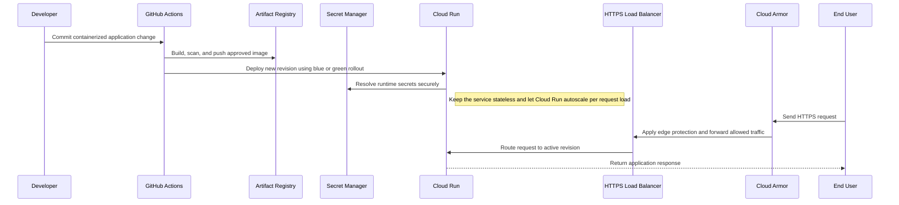
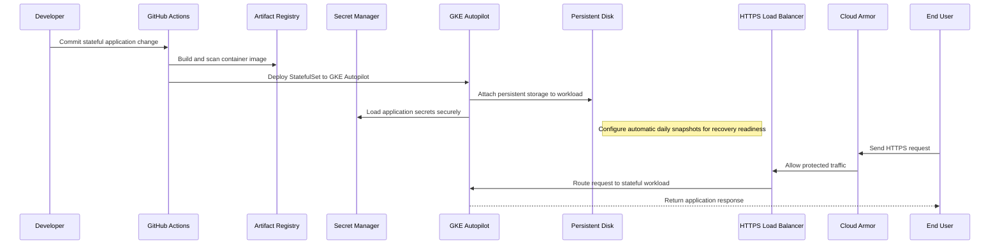
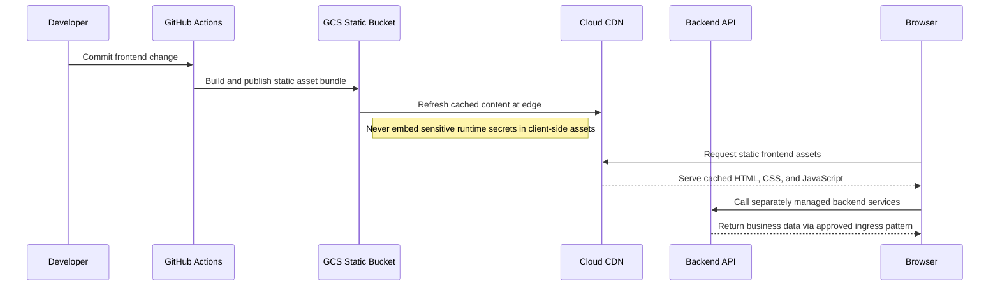

# Web Application Deployment Patterns

## Web Application Deployment Patterns

**Version:** 0.1
**Status:** Draft – Pending Architecture Review
**Audience:** Solution Architects, Integration Engineers, Security and Operations Teams

---

## Document Introduction

### Purpose of Document

This document defines approved deployment patterns for Entegris web applications on GCP. It helps teams choose the right hosting model for stateless services, stateful platforms, and static frontends while preserving security and release discipline.

- The value of the pattern is speed to execution — leveraging what others have done before and quickly achieving business outcomes
- A pattern is best expressed as: When to use, When Not to use certain technologies/approaches
- This document is for designers and architects who need to deploy web applications to GCP using the right runtime, perimeter, and release approach for the workload
- If implemented properly, these patterns enable you to get to production as fast as possible and have the most stable, scalable, and maintenance-free set of applications possible

### Scope and Applicability

These patterns cover containerized and static web application deployment options across the Entegris application stack.

- Deployment of Java, Python, TypeScript, React, and related web workloads to Cloud Run, GKE, and static hosting services
- Release, protection, and runtime practices for internet-facing Entegris applications

**Environments:**

- Cloud

### Intended Audience

- Solution Architects
- Application Developers
- Platform Engineers
- Security and Operations Teams

---

## Context

- Cloud Run is the preferred runtime for stateless containerized applications because it simplifies scaling and operations
- GKE is reserved for stateful, complex, or unusually high-scale workloads that need deeper orchestration control
- All internet-facing applications must sit behind an HTTPS load balancer protected by Cloud Armor
- Container images are built in GitHub Actions and stored in GCP Artifact Registry before deployment

### Why Use These Patterns

- Reduce cost through consolidation of functionality
- Agility through solutions based on a set of services that supports restructuring and reconfiguration of business processes
- Time-to-market through business-aligned solutions
- Alignment between IT and business goals, enabling re-use over time

---

## Architecture Principles

### Enterprise Principles

- Keep It Simple
- Remove Friction
- Think Big and Execute Rapidly

### Domain-Specific Principles

- Cloud-Smart by Default
- Internet and API First
- Observability and Reliability by Design

### Security Principles

- Security and Privacy by Design
- Defense in Depth
- Security Assurance Through Least Privilege

---

## High-Level Solution Patterns

| Solution | When to Use | When Not to Use |
|---|---|---|
| Stateless App Deployment Pattern |• Application is containerized and stateless • Autoscaling and pay-per-use are desirable|• The workload requires persistent in-cluster state or deep Kubernetes control • Stateful dependencies are being embedded inside the app runtime|
| Stateful App Deployment Pattern |• Application needs stateful clustering, persistent volumes, or advanced orchestration • Operational complexity justifies Kubernetes|• The service is stateless and could run on Cloud Run • Teams want GKE only because it is familiar rather than necessary|
| Static Frontend Deployment Pattern |• Frontend is a built React or TypeScript or similar static asset bundle • Global performance and caching matter|• Server-side stateful rendering or custom runtime logic is required • Teams want to serve static assets from an application container unnecessarily|

---

## Pattern Selection Matrix

| Scenario Cue | Workload State | Scale Profile | Direction | Recommended Pattern | Notes |
| --- | --- | --- | --- | --- | --- |
| REST API or stateless web app | Stateless container | Elastic variable load | User → GCP app | Stateless App Deployment Pattern | Use Cloud Run with min instances = 1 for production to eliminate cold start latency |
| Complex platform service with persistent state | Stateful or orchestration-heavy | High or specialized scale | User → GKE app | Stateful App Deployment Pattern | Use GKE Autopilot for stateful workloads requiring persistent storage, batch processing, or Kubernetes ecosystem tools (Helm, operators); provision separate node pools per environment |
| React frontend for public portal | Static assets | Global read-heavy traffic | User → CDN → Assets | Static Frontend Deployment Pattern | Enable Cloud CDN with cache-control headers; set TTL to 1 hour for HTML, 1 year for JS/CSS |

---

## Canonical Patterns

### Stateless App Deployment Pattern

| Area | Description |
|---|---|
| **Context** | A web application or API is packaged as a container and maintains no local runtime state between requests. The team wants fast deployment, autoscaling, and low operational overhead. |
| **Problem** | How do we deploy a stateless web workload quickly while still meeting Entegris requirements for secure ingress, observability, and release safety? |
| **Solution** | • Build the container in GitHub Actions, push it to GCP Artifact Registry, and deploy it to Cloud Run • Place the service behind an HTTPS load balancer protected by Cloud Armor and configure health checks and monitoring • Use blue/green or canary deployment techniques and retrieve secrets from GCP Secret Manager at runtime |
| **Benefits** | • Minimizes infrastructure management for most web applications • Supports automatic scaling and efficient pay-per-use operation • Aligns closely to the Entegris preferred application hosting model |
| **Considerations** | • Applications must remain stateless and externalize session or data persistence • Runtime tuning, startup latency, and connection handling still need performance validation |

### Stateful App Deployment Pattern

| Area | Description |
|---|---|
| **Context** | A workload requires Kubernetes-level orchestration, persistent volumes, or specialized runtime behavior that a stateless platform cannot provide. The business case justifies the additional operating complexity. |
| **Problem** | How do we host complex or stateful web applications when Cloud Run is not a fit, without giving up secure ingress and disciplined release controls? |
| **Solution** | • Build and scan container images in GitHub Actions, publish them to Artifact Registry, and deploy them to GKE • Use GKE Autopilot with StatefulSets for database-backed apps; attach persistent volumes via GCP Persistent Disk with automatic daily snapshots • Expose the workload through an HTTPS load balancer with Cloud Armor and keep secrets in GCP Secret Manager |
| **Benefits** | • Supports workloads that need advanced orchestration or persistent runtime state • Provides Kubernetes primitives for complex scaling and deployment requirements • Keeps security and delivery standards consistent with other Entegris web workloads |
| **Considerations** | • GKE introduces higher operational overhead and should be justified explicitly • Stateful rollout, backup, and recovery design become part of production readiness |

### Static Frontend Deployment Pattern

| Area | Description |
|---|---|
| **Context** | A frontend application compiles to static assets and consumes APIs hosted elsewhere. Performance and simplicity matter more than server-side runtime logic. |
| **Problem** | How do we deploy a static frontend efficiently without wrapping it in an unnecessary application server? |
| **Solution** | • Build the frontend in GitHub Actions and publish the static artifact bundle to a GCS bucket • Serve the assets through Cloud CDN for global performance and cache efficiency • Route API calls to separately managed backend services that follow the approved ingress patterns |
| **Benefits** | • Simplifies hosting and reduces runtime cost for static experiences • Improves performance through CDN distribution and caching • Separates frontend delivery concerns from backend application runtime |
| **Considerations** | • Cache invalidation and frontend configuration management must be designed deliberately • Sensitive runtime secrets should never be embedded in client-side code or build artifacts |

## Sequence Diagrams

### Stateless App Deployment Pattern Flow

### Stateful App Deployment Pattern Flow

### Static Frontend Deployment Pattern Flow

---

## Tips and Best Practices

- Use Cloud Run for stateless web apps; use GKE only when Kubernetes ecosystem is required
- Store application secrets in GCP Secret Manager mounted as environment variables at runtime
- Implement Cloud CDN for static assets to reduce origin load and improve global latency
- Log all application errors to Cloud Logging with correlation_id and user_id tags
- Use Cloud Monitoring uptime checks with PagerDuty integration for 24/7 incident response
