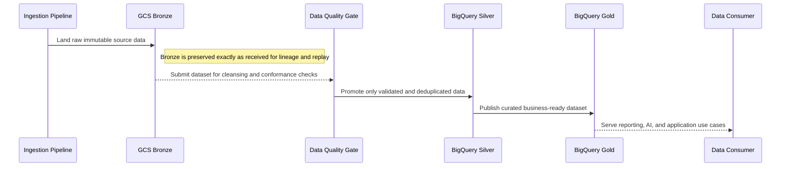
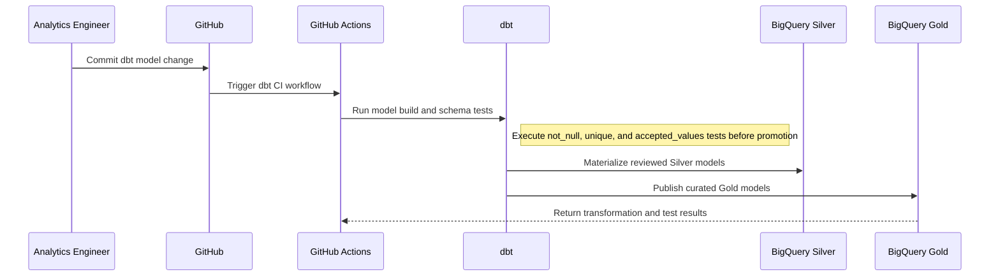
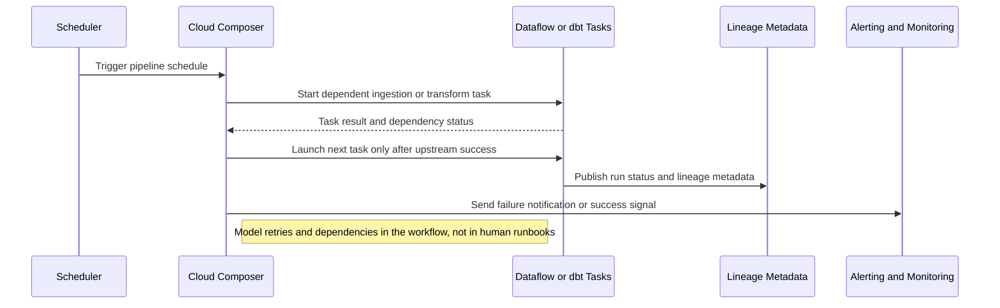

# Reference Architecture — Data Engineering & Medallion Architecture Patterns

## Data Engineering and Medallion Architecture Patterns

**Version:** 0.1
**Status:** Draft – Pending Architecture Review
**Audience:** Solution Architects, Integration Engineers, Security and Operations Teams

---

## Document Introduction

### Purpose of Document

This document defines approved data engineering patterns for promoting data through the Entegris medallion architecture. It helps teams structure transformations, testing, and orchestration in a way that is scalable and supportable.

- The value of the pattern is speed to execution — leveraging what others have done before and quickly achieving business outcomes
- A pattern is best expressed as: When to use, When Not to use certain technologies/approaches
- This document is for designers and architects who need to turn raw ingested data into governed analytical products using the Entegris Bronze, Silver, and Gold model
- If implemented properly, these patterns enable you to get to production as fast as possible and have the most stable, scalable, and maintenance-free set of applications possible

### Scope and Applicability

These patterns cover medallion promotion, dbt-based transformation, and orchestration of analytical pipelines on GCP.

- Promotion of raw GCS Bronze data into cleansed BigQuery Silver and curated Gold datasets
- Version-controlled transformation and orchestration practices for analytics and AI-ready data products

**Environments:**

- Cloud

### Intended Audience

- Solution Architects
- Data Engineers
- Analytics Engineers
- Security and Operations Teams

---

## Context

- Bronze storage in GCS is immutable and retains data as received for replay and audit
- Silver data in BigQuery must be cleansed, deduplicated, and conformed to stable schemas
- Gold data should be optimized for BI, AI, and serving workloads rather than raw ingestion convenience
- dbt (data build tool) is the standard transformation framework for Silver and Gold layer SQL modeling
- dbt models are version-controlled in GitHub and should be validated in CI before merge

### Why Use These Patterns

- Reduce cost through consolidation of functionality
- Agility through solutions based on a set of services that supports restructuring and reconfiguration of business processes
- Time-to-market through business-aligned solutions
- Alignment between IT and business goals, enabling re-use over time

---

## Architecture Principles

### Enterprise Principles

- Loosely Coupled and Interoperable Solutions
- Platform Over Point Solutions
- Keep It Simple

### Domain-Specific Principles

- Data Quality at the Source
- Data Domains and Accountability
- Governed Metadata Management

### Security Principles

- Security and Privacy by Design
- Trust Through Data Stewardship
- Security Assurance Through Least Privilege

---

## High-Level Solution Patterns

| Solution | When to Use | When Not to Use |
|---|---|---|
| Medallion Promotion Pattern |• Need a clear separation of raw, cleansed, and curated data responsibilities • Must preserve source lineage and replay capability|• The use case is a one-off ad hoc export with no platform lifecycle • Teams want to transform raw data in place|
| dbt Transformation Pattern |• Need SQL-based, version-controlled transformations in Silver and Gold • Data quality tests must run with the model definitions|• Transformations are better expressed as heavy custom code rather than SQL models • Teams plan to manage business logic manually in BI tools|
| Pipeline Orchestration Pattern |• Need scheduled runs, dependencies, retries, and alerting across multiple datasets • Several jobs must coordinate promotion order|• A single isolated script has no downstream dependencies • Teams expect informal manual execution in production|

---

## Pattern Selection Matrix

| Scenario Cue | Transformation Style | Orchestration Need | Direction | Recommended Pattern | Notes |
| --- | --- | --- | --- | --- | --- |
| New source entering analytics platform | Layered landing and cleansing | Basic to moderate | Bronze → Silver → Gold | Medallion Promotion Pattern | Land every source in GCS Bronze and register ingestion metadata in BigQuery; no direct source-to-Silver exceptions without TRB approval |
| Business-ready conformed model buildout | SQL-centric transformation | Integrated with CI | Silver → Gold | dbt Transformation Pattern | All dbt models must include data tests (not_null, unique) and be peer-reviewed in GitHub PRs |
| Multiple interdependent datasets and schedules | Mixed transformation steps | High dependency management | Pipeline → Managed execution | Pipeline Orchestration Pattern | Use Cloud Composer for <20 pipelines; consider Prefect for larger DAG portfolios |

---

## Canonical Patterns

### Medallion Promotion Pattern

| Area | Description |
|---|---|
| **Context** | Raw source data lands in Bronze and must move through progressively higher-trust layers for enterprise use. Different consumers need raw traceability, cleansed views, and curated serving outputs. |
| **Problem** | How do we structure data promotion so raw lineage is preserved while consumers receive reliable and business-ready datasets? |
| **Solution** | • Keep Bronze data immutable in GCS exactly as received from the ingestion pipeline • Promote data into Silver BigQuery tables only after cleansing, deduplication, schema conformance, and data-quality checks are complete • Publish Gold tables as curated, consumption-oriented datasets optimized for reporting, AI, or application serving |
| **Benefits** | • Separates raw capture from data-quality and business-shaping responsibilities • Supports replay and root-cause analysis through preserved Bronze lineage • Improves trust and reuse of analytical datasets over time |
| **Considerations** | • Promotion criteria must be explicit so teams do not shortcut Bronze-to-Gold movement • Storage and metadata governance need to account for multiple lifecycle layers |

### dbt Transformation Pattern

| Area | Description |
|---|---|
| **Context** | Silver and Gold transformations are primarily SQL-oriented and need version control, testing, and repeatable deployment. Analytics teams want a common framework rather than unmanaged scripts. |
| **Problem** | How do we implement governed transformations in BigQuery without scattering logic across notebooks, ad hoc SQL, and BI tools? |
| **Solution** | • Define Silver and Gold transformations as dbt models stored in GitHub with clear ownership and naming conventions • Run dbt tests such as not_null, unique, and accepted_values in CI and before promotion to higher-trust datasets • Optimize models for partitioning, clustering, and reuse across analytics and AI workloads |
| **Benefits** | • Makes transformation logic reviewable, testable, and reusable • Improves data quality by attaching tests directly to model definitions • Supports disciplined promotion of analytical logic through environments |
| **Considerations** | • Model dependency graphs and naming conventions need active governance to stay understandable • dbt is best for SQL-centric transformations and should not be forced onto unsuitable processing workloads |

### Pipeline Orchestration Pattern

| Area | Description |
|---|---|
| **Context** | Data pipelines span multiple jobs, schedules, and dependencies that require coordinated execution. Operators need alerts, retries, and a clear run history when issues occur. |
| **Problem** | How do we orchestrate medallion pipelines so dependent datasets run in order and failures are visible and recoverable? |
| **Solution** | • Use an approved orchestration layer such as Cloud Composer or a managed Dataflow-driven schedule based on solution complexity • Model dataset dependencies, retries, and failure notifications as part of the orchestrated workflow rather than in human runbooks • Publish run status, alerts, and lineage metadata so support teams can identify where promotion failed |
| **Benefits** | • Improves operational clarity for complex multi-step pipelines • Reduces manual coordination and brittle schedule dependencies • Supports reliable promotion of data products across environments and time windows |
| **Considerations** | • Choose the orchestration tool based on dependency complexity, not personal preference • Alert fatigue should be managed through actionable notifications and clear ownership |

## Sequence Diagrams

### Medallion Promotion Pattern Flow

### dbt Transformation Pattern Flow

### Pipeline Orchestration Pattern Flow

---

## Tips and Best Practices

- Use Dataflow for transformations exceeding 1M records; use BigQuery SQL for lighter workloads
- Store sensitive PII only in BigQuery tables with column-level encryption and DLP scanning enabled
- Partition tables by business_date and cluster by high-cardinality keys to optimize query performance
- Use GCS lifecycle policies to auto-archive Bronze data to Coldline after 90 days
- Log all Dataflow job metrics to Cloud Monitoring with custom dimensions for data lineage tracking
