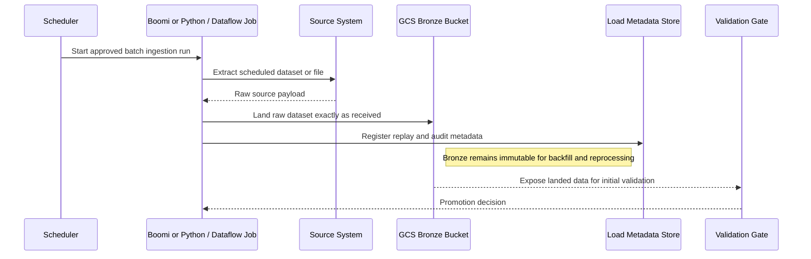
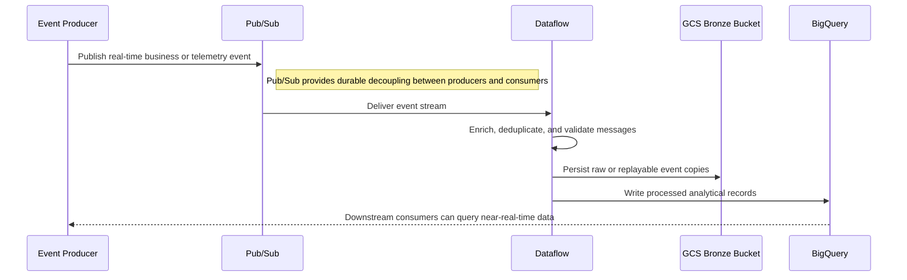
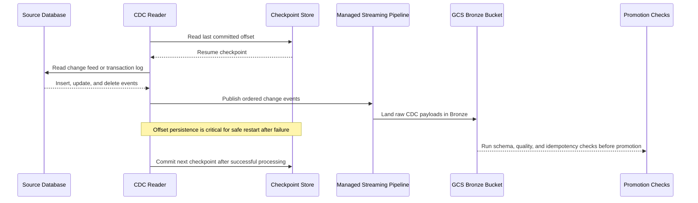

# Data Ingestion Patterns

## Enterprise Data Ingestion Patterns

**Version:** 0.1
**Status:** Draft – Pending Architecture Review
**Audience:** Solution Architects, Integration Engineers, Security and Operations Teams

---

## Document Introduction

### Purpose of Document

This document defines approved patterns for moving source data into the Entegris GCP data platform. It helps architects choose the right ingestion approach based on latency, source behavior, and Bronze landing requirements.

- The value of the pattern is speed to execution — leveraging what others have done before and quickly achieving business outcomes
- A pattern is best expressed as: When to use, When Not to use certain technologies/approaches
- This document is for designers and architects who need to ingest source data into the medallion architecture with the right balance of freshness, quality, and operational control
- If implemented properly, these patterns enable you to get to production as fast as possible and have the most stable, scalable, and maintenance-free set of applications possible

### Scope and Applicability

These patterns cover batch, streaming, and CDC ingestion into the Entegris GCP data platform.

- Source system extracts that land raw data in GCS Bronze for downstream promotion
- Real-time and near-real-time event pipelines into Pub/Sub, Dataflow, GCS, and BigQuery

**Environments:**

- Cloud
- Hybrid
- SaaS

### Intended Audience

- Solution Architects
- Data Engineers
- Integration Engineers
- Security and Operations Teams

---

## Context

- All raw data must land in GCS Bronze before any Silver or Gold promotion activity occurs
- Batch ingestion is suitable when business timing is scheduled and source systems do not emit reliable events
- Streaming ingestion uses Pub/Sub as the event bus and Dataflow for transformation or routing in motion
- CDC is used when database-level changes must be captured faster than periodic extracts can support

### Why Use These Patterns

- Reduce cost through consolidation of functionality
- Agility through solutions based on a set of services that supports restructuring and reconfiguration of business processes
- Time-to-market through business-aligned solutions
- Alignment between IT and business goals, enabling re-use over time

---

## Architecture Principles

### Enterprise Principles

- Loosely Coupled and Interoperable Solutions
- Platform Over Point Solutions
- Keep It Simple

### Domain-Specific Principles

- Data Quality at the Source
- Single Source of Truth
- Integration Through Standard Middleware

### Security Principles

- Security and Privacy by Design
- Security Assurance Through Least Privilege
- Trust Through Data Stewardship

---

## High-Level Solution Patterns

| Solution | When to Use | When Not to Use |
|---|---|---|
| Batch Ingestion |• Source extraction is scheduled and business latency is measured in minutes or hours • Boomi or Python or Dataflow jobs can pull data on a predictable cadence|• Sub-minute latency is required • Source change volume makes repeated full extraction inefficient|
| Streaming Ingestion |• Source emits events continuously or near real time • Need Pub/Sub and Dataflow for in-flight processing and routing|• Source cannot produce reliable events • The use case is purely scheduled and batch-oriented|
| CDC Ingestion |• Need database row-level changes faster than batch extracts • Source logs or change feed can be captured reliably|• The source is file-based rather than database-based • A simple batch pull meets latency and operational needs|

---

## Pattern Selection Matrix

| Scenario Cue | Latency Need | Source Type | Direction | Recommended Pattern | Notes |
| --- | --- | --- | --- | --- | --- |
| Nightly ERP export to analytics | Scheduled | Application extract or file | Source → GCP | Batch Ingestion | Use Boomi for <50K records/batch with retry logic; switch to Aecorsoft when volume exceeds 100K to avoid Boomi timeout limits |
| Operational events from application services | Near real time | Event stream | Source → GCP | Streaming Ingestion | Configure Pub/Sub message retention to 7 days to enable replay during pipeline failures |
| Replicating transactional database changes | Low-latency continuous | Relational database | Database → GCP | CDC Ingestion | Use Striim for CDC from Oracle/SQL Server; use Debezium for PostgreSQL/MySQL sources |

---

## Canonical Patterns

### Batch Ingestion

| Area | Description |
|---|---|
| **Context** | A source system provides data on a schedule through extracts, files, or periodic API reads. The downstream data platform can accept scheduled freshness and predictable operational windows. |
| **Problem** | How do we ingest scheduled source data into GCP while preserving a raw Bronze landing and clean replay behavior? |
| **Solution** | • Use Boomi or a Python or Dataflow job to extract the source data on the approved schedule • Write the raw dataset to GCS Bronze exactly as received and register load metadata for replay and audit • Run initial validation at the ingestion gate so only qualified data is promoted from Bronze to Silver |
| **Benefits** | • Fits many legacy and SaaS source systems with simple operational timing • Makes backfill and reprocessing straightforward because raw snapshots are retained • Keeps ingestion costs and operational complexity lower than always-on streaming |
| **Considerations** | • Batch windows can create freshness delays for downstream users • Large full loads may require chunking or parallelism to meet processing windows |

### Streaming Ingestion

| Area | Description |
|---|---|
| **Context** | A source emits business or telemetry events continuously and downstream consumers need data quickly. The platform must handle event spikes and process messages durably in motion. |
| **Problem** | How do we move real-time events into the Entegris data platform with standard cloud services and reliable downstream processing? |
| **Solution** | • Use Pub/Sub as the event bus for durable decoupling between producers and consumers • Process or enrich the event stream with Dataflow and route raw or processed outputs to GCS Bronze and/or BigQuery as required • Design message keys, deduplication, and sink logic so the pipeline can be replayed without duplicate business results |
| **Benefits** | • Supports low-latency ingestion for operational and analytical use cases • Scales elastically with varying event volume • Decouples event producers from downstream consumers |
| **Considerations** | • Streaming pipelines require stronger monitoring, schema governance, and back-pressure design than batch jobs • Late-arriving or malformed events need explicit handling policies |

### CDC Ingestion

| Area | Description |
|---|---|
| **Context** | A relational source database changes too frequently for periodic snapshots to be efficient. Downstream systems need record-level updates with minimal delay. |
| **Problem** | How do we capture source database changes continuously without relying on duplicate-prone polling logic? |
| **Solution** | • Capture database changes from the source change feed or logs and publish them into a managed streaming pipeline • Persist offsets or checkpoints so the CDC reader can resume safely after failure • Land raw change events in Bronze and promote only after schema, quality, and idempotency checks are satisfied |
| **Benefits** | • Provides fresher downstream data than periodic extracts • Reduces the overhead of repeatedly reading unchanged rows • Supports scalable propagation of transactional changes into analytics and integration platforms |
| **Considerations** | • CDC semantics for deletes, updates, and schema evolution must be understood by downstream consumers • Database log retention and checkpoint management become critical operational dependencies |

## Sequence Diagrams

### Batch Ingestion Flow

### Streaming Ingestion Flow

### CDC Ingestion Flow

---

## Tips and Best Practices

- Store all source system credentials in GCP Secret Manager, never in code or config files
- Use Boomi for orchestration and error handling; avoid custom Python scripts unless volume exceeds Boomi limits
- Land raw data in GCS Bronze with ingestion_timestamp and source_system_id for full traceability
- Partition BigQuery landing tables by ingestion_date to control query costs as data grows
- Implement dead letter queues in Pub/Sub for failed messages requiring manual investigation
