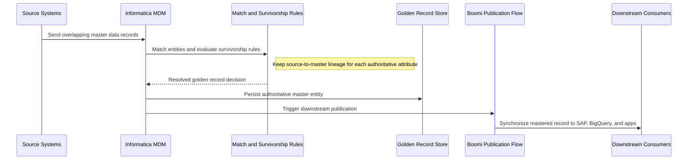
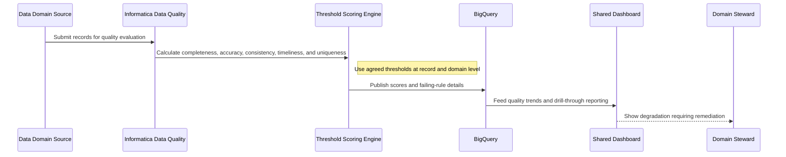
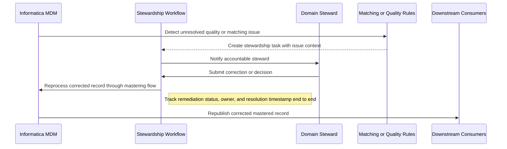

# Master Data Management & Data Quality Patterns

## Master Data Management and Data Quality Patterns

**Version:** 0.1
**Status:** Draft – Pending Architecture Review
**Audience:** Solution Architects, Integration Engineers, Security and Operations Teams

---

## Document Introduction

### Purpose of Document

This document defines approved patterns for master data management and data quality at Entegris. It helps teams use Informatica to create authoritative master records, measure quality, and resolve stewardship issues in a governed way.

- The value of the pattern is speed to execution — leveraging what others have done before and quickly achieving business outcomes
- A pattern is best expressed as: When to use, When Not to use certain technologies/approaches
- This document is for designers and architects who need to design master data and quality solutions that create trusted records and measurable remediation workflows
- If implemented properly, these patterns enable you to get to production as fast as possible and have the most stable, scalable, and maintenance-free set of applications possible

### Scope and Applicability

These patterns cover golden record creation, quality scoring, and stewardship workflows for enterprise master data domains.

- Master data domains such as customer, product, supplier, and material governed through Informatica MDM
- Quality scoring, issue remediation, and downstream synchronization to SAP, BigQuery, and other applications

**Environments:**

- Cloud
- Hybrid
- SaaS

### Intended Audience

- Solution Architects
- Data Governance Leads
- Data Engineers
- Security and Operations Teams

---

## Context

- Informatica is the standard MDM platform for creating and governing enterprise master data records
- Survivorship rules in Informatica determine the single authoritative golden record for each mastered entity
- Each master data domain has an Information Governor accountable for data quality outcomes
- Quality dimensions such as completeness, accuracy, consistency, timeliness, and uniqueness must be measured explicitly

### Why Use These Patterns

- Reduce cost through consolidation of functionality
- Agility through solutions based on a set of services that supports restructuring and reconfiguration of business processes
- Time-to-market through business-aligned solutions
- Alignment between IT and business goals, enabling re-use over time

---

## Architecture Principles

### Enterprise Principles

- Demonstrate Trustworthiness and Stewardship
- Keep It Simple
- Platform Over Point Solutions

### Domain-Specific Principles

- Data Quality at the Source
- Single Source of Truth
- Data Domains and Accountability

### Security Principles

- Trust Through Data Stewardship
- Security and Privacy by Design
- Security Assurance Through Least Privilege

---

## High-Level Solution Patterns

| Solution | When to Use | When Not to Use |
|---|---|---|
| Golden Record Pattern |• Need one authoritative master record across multiple source systems • Survivorship and matching rules can be defined in Informatica|• The dataset is transient and not a governed master domain • Teams plan to let each application remain the sole authority with no mastering process|
| Data Quality Scoring Pattern |• Need measurable quality metrics for a master data domain • Rules and thresholds can be defined in Informatica|• There is no agreement on quality rules or accountable owners • Teams only want anecdotal quality assessment|
| Stewardship Workflow Pattern |• Need a defined remediation process for failing master data records • A data steward must review and resolve issues|• The issue can be auto-corrected with no human judgement required • No steward or domain owner is assigned|

---

## Pattern Selection Matrix

| Scenario Cue | Data Need | Quality Maturity | Direction | Recommended Pattern | Notes |
| --- | --- | --- | --- | --- | --- |
| Conflicting customer records across source systems | Authoritative mastered entity | Foundational | Sources → Informatica → Consumers | Golden Record Pattern | Use Informatica MDM with match scores >90 for auto-merge; route <90 to stewards for review |
| Need domain quality dashboard and SLA tracking | Quality measurement | Managed | Informatica → BigQuery | Data Quality Scoring Pattern | Define rules for completeness (required fields), accuracy (format validation), and uniqueness (duplicate detection using fuzzy match threshold of 85%); publish DQ rule results to BigQuery daily for weekly steward review |
| Master record fails validation and needs human decision | Issue remediation | Operationalized | Issue → Steward → Reprocess | Stewardship Workflow Pattern | Use ServiceNow for steward task assignment with 5-day SLA for critical data domains |

---

## Canonical Patterns

### Golden Record Pattern

| Area | Description |
|---|---|
| **Context** | Multiple systems hold overlapping versions of the same master entity and the enterprise needs one trusted representation. Downstream applications and analytics depend on a single authoritative record. |
| **Problem** | How do we create one authoritative master record when source systems disagree or provide incomplete data? |
| **Solution** | • Use Informatica MDM to match source records and apply survivorship rules that determine the golden record for each entity • Model source-to-master lineage so consumers can trace which source values contributed to the authoritative record • Synchronize mastered records to downstream consumers such as SAP, BigQuery, and operational applications through approved integration paths |
| **Benefits** | • Creates a consistent enterprise view of key entities across systems • Reduces duplicate and conflicting master data in downstream processes • Improves trust in analytical and operational decisions that depend on mastered data |
| **Considerations** | • Matching and survivorship rules need domain-owner input and periodic review • Golden record publication timing and conflict handling must be understood by downstream systems |

### Data Quality Scoring Pattern

| Area | Description |
|---|---|
| **Context** | A data domain needs objective evidence of quality rather than anecdotal assessment. Business and technical owners want trends, thresholds, and operational visibility. |
| **Problem** | How do we measure master data quality consistently so teams know when a domain is improving or degrading? |
| **Solution** | • Define Informatica quality rules for completeness, accuracy, consistency, timeliness, and uniqueness • Score rule outcomes against agreed thresholds at record and domain level • Publish domain scores and failing-rule details to BigQuery for shared dashboards and steward review |
| **Benefits** | • Makes quality visible and measurable for business and technical stakeholders • Supports proactive governance conversations based on shared metrics • Helps prioritize remediation on the most impactful domains or rule failures |
| **Considerations** | • Scores are only meaningful when rules, thresholds, and ownership are agreed and maintained • Dashboards should expose drill-through to failing rules, not just headline percentages |

### Stewardship Workflow Pattern

| Area | Description |
|---|---|
| **Context** | Some master data issues cannot be resolved automatically and require domain-specific judgement. Resolution needs to be tracked so corrected records can re-enter downstream flows safely. |
| **Problem** | How do we route unresolved master data issues to the right steward and ensure corrected data is reprocessed reliably? |
| **Solution** | • Use Informatica stewardship workflows to notify the accountable domain steward when records fail quality or matching rules • Track remediation status, steward decisions, and resolution timestamps as part of the issue lifecycle • Reprocess corrected records through the mastering and downstream publication flow once resolution is complete |
| **Benefits** | • Creates clear accountability for unresolved master data issues • Improves recovery time by giving stewards structured tasks and visibility • Ensures downstream consumers receive corrected mastered data rather than ad hoc fixes |
| **Considerations** | • Every master data domain needs an assigned steward and escalation path to keep workflows moving • Issue prioritization is necessary so stewards focus on records with the highest business impact first |

## Sequence Diagrams

### Golden Record Pattern Flow

### Data Quality Scoring Pattern Flow

### Stewardship Workflow Pattern Flow

---

## Tips and Best Practices

- Use Informatica Cloud for MDM golden record resolution; avoid custom merge logic
- Store data quality rules in BigQuery tables version-controlled in GitHub
- Log all DQ failures to Cloud Logging with rule_id, record_id, and failure_reason for auditability
- Implement DLP scanning on PII columns before promoting Bronze to Silver
- Use Looker dashboards for DQ scorecards reviewed weekly by data stewards
