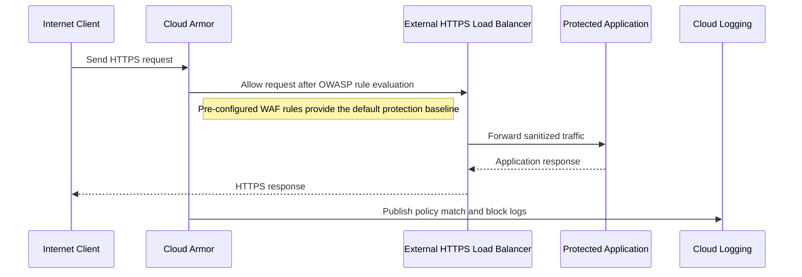
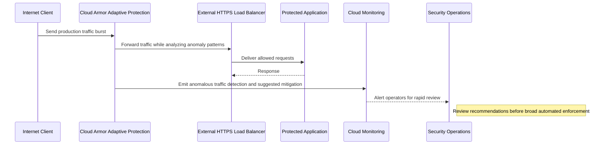
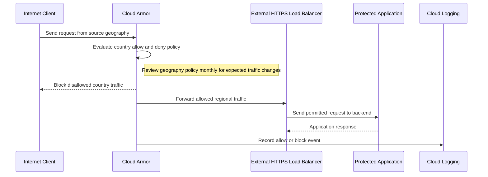
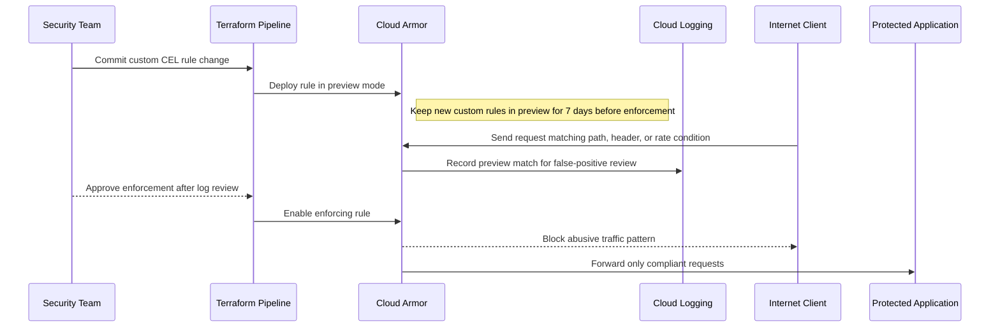

# Reference Architecture — Google Cloud Armor Usage Patterns

## Google Cloud Armor Usage Patterns

**Version:** 0.1
**Status:** Draft – Pending Architecture Review
**Audience:** Solution Architects, Integration Engineers, Security and Operations Teams

---

## Document Introduction

### Purpose of Document

This document defines approved usage patterns for Google Cloud Armor in front of Entegris internet-facing workloads. It helps teams apply a consistent WAF, DDoS, and geographic access posture before applications are exposed.

- The value of the pattern is speed to execution — leveraging what others have done before and quickly achieving business outcomes
- A pattern is best expressed as: When to use, When Not to use certain technologies/approaches
- This document is for designers and architects who need to protect internet-facing Entegris applications with mandatory perimeter security controls on GCP
- If implemented properly, these patterns enable you to get to production as fast as possible and have the most stable, scalable, and maintenance-free set of applications possible

### Scope and Applicability

These patterns cover Cloud Armor policy use with external HTTPS load balancing for public web applications and APIs.

- Standard WAF enforcement for internet-facing endpoints
- Advanced threat detection and geographic access control using Cloud Armor policies

**Environments:**

- Cloud

### Intended Audience

- Solution Architects
- Security Engineers
- Platform Engineers
- Operations Teams

---

## Context

- Cloud Armor must always be attached to an External HTTPS Load Balancer and the protected application must not expose an alternate public path
- Security policies should combine pre-configured WAF rules with application-specific custom rules based on risk
- Adaptive Protection is expected for production workloads to strengthen DDoS detection and response
- Threat events and policy matches must be logged to Cloud Logging and reviewed on a defined cadence

### Why Use These Patterns

- Reduce cost through consolidation of functionality
- Agility through solutions based on a set of services that supports restructuring and reconfiguration of business processes
- Time-to-market through business-aligned solutions
- Alignment between IT and business goals, enabling re-use over time

---

## Architecture Principles

### Enterprise Principles

- Demonstrate Trustworthiness and Stewardship
- Keep It Simple
- Remove Friction

### Domain-Specific Principles

- Internet and API First
- Observability and Reliability by Design

### Security Principles

- Security and Privacy by Design
- Defense in Depth
- Security Assurance Through Least Privilege

---

## High-Level Solution Patterns

| Solution | When to Use | When Not to Use |
|---|---|---|
| Standard WAF Protection |• Need baseline protection against common web exploits • Application is internet-facing and behind an external HTTPS load balancer|• The workload is not internet-facing • Teams expect to bypass central WAF policy for convenience|
| Adaptive Protection |• Production workload has meaningful DDoS or volumetric attack risk • Traffic patterns are large enough to benefit from anomaly detection|• Environment is non-production with no exposure to realistic traffic patterns • The application cannot support automated mitigation tuning|
| Geo-restriction Pattern |• Business access should be limited to approved countries or regions • Threat reduction can be achieved by blocking unexpected geographies|• Legitimate users are globally distributed without stable geography • IP geolocation would create unacceptable false positives|
| Custom Rule Pattern |• Need application-specific protection beyond pre-configured WAF or geo controls • Threat signatures can be expressed as paths, headers, or IP-based logic|• Standard WAF protections already address the risk without extra tuning • Teams want to implement edge security checks only in application code|

---

## Pattern Selection Matrix

| Scenario Cue | Threat Profile | Traffic Pattern | Direction | Recommended Pattern | Notes |
| --- | --- | --- | --- | --- | --- |
| New external API launch | Baseline web exploit risk | Predictable internet traffic | Internet → GCP | Standard WAF Protection | Enable OWASP ModSecurity Core Rule Set v3.3; tune to reduce false positives on known safe traffic |
| Mission-critical production portal | Elevated DDoS risk | Large or variable internet traffic | Internet → GCP | Adaptive Protection | Set baseline threshold at 95th percentile of normal traffic; auto-block IPs exceeding 10x baseline for 1 hour |
| Region-limited supplier portal | Country-specific threat reduction | Restricted geography | Internet → GCP | Geo-restriction Pattern | Block traffic from high-risk countries (Russia, North Korea, Iran) unless business exception documented in TRB |
| Repeated abuse of a sensitive application path or header | Application-specific threat | Known malicious signature | Internet → GCP | Custom Rule Pattern | Use Cloud Armor custom CEL rules in preview mode for 7 days before enforcement |

---

## Canonical Patterns

### Standard WAF Protection

| Area | Description |
|---|---|
| **Context** | An internet-facing Entegris application or API needs baseline web protection before any request reaches the backend. The service is already fronted by an external HTTPS load balancer. |
| **Problem** | How do we apply a consistent default WAF posture that blocks common attacks without each team inventing its own front-door security model? |
| **Solution** | • Attach a Cloud Armor security policy to the External HTTPS Load Balancer protecting the application • Enable pre-configured rules aligned to OWASP-focused protections and add custom allow or deny rules based on application behavior • Send policy match logs to Cloud Logging and operational alerts to Cloud Monitoring so security events are visible |
| **Benefits** | • Delivers a standard secure starting point for all public workloads • Reduces duplicated WAF design effort across teams • Improves visibility into attack traffic before it reaches the application |
| **Considerations** | • Policy tuning is still required to minimize false positives for legitimate application flows • Direct public exposure outside the protected load balancer is not permitted |

### Adaptive Protection

| Area | Description |
|---|---|
| **Context** | A production workload has sufficient internet exposure and business criticality to justify stronger automated attack detection. Operations teams need early warning of volumetric or anomalous traffic shifts. |
| **Problem** | How do we improve detection and mitigation of emerging DDoS patterns without relying only on static rules? |
| **Solution** | • Enable Cloud Armor Adaptive Protection for production workloads fronted by the external HTTPS load balancer • Review suggested mitigations and align response automation with the application risk profile and support model • Integrate detections and mitigation events into Cloud Monitoring and operational runbooks for rapid response |
| **Benefits** | • Strengthens detection of abnormal traffic patterns beyond static signatures • Improves resilience of critical internet-facing services • Gives operators earlier, richer signals for attack investigation |
| **Considerations** | • Adaptive recommendations should be reviewed and tested before broad automated enforcement • Production traffic history is important for the feature to provide useful signals |

### Geo-restriction Pattern

| Area | Description |
|---|---|
| **Context** | A workload is intended for a limited set of countries or business regions. Blocking unexpected geographies materially reduces the exposed threat surface. |
| **Problem** | How do we enforce geographic access policy at the edge instead of pushing region checks into every application? |
| **Solution** | • Implement Cloud Armor custom rules that allow or deny traffic by country according to business policy • Apply the policy at the external HTTPS load balancer so disallowed requests never reach the application • Log blocked events and review changes to expected traffic geography during monthly policy reviews |
| **Benefits** | • Reduces exposure to traffic from regions that should never access the service • Simplifies compliance and contractual enforcement at the perimeter • Centralizes geography-based access policy in one control plane |
| **Considerations** | • Geolocation is an approximation and must be assessed for false-positive impact • Traveling users or globally distributed partners may require alternate access handling |

### Custom Rule Pattern

| Area | Description |
|---|---|
| **Context** | A public Entegris application has request patterns, headers, or paths that need protection beyond standard pre-configured WAF rules. Security teams need an edge control that matches application-specific abuse without waiting for backend code changes. |
| **Problem** | How do we block application-specific threats at the edge without embedding every protection directly in the application? |
| **Solution** | • Write Cloud Armor custom CEL rules for request paths, headers, IP ranges, or rate conditions that identify the abusive pattern • Deploy new rules in preview mode for 7 days, review Cloud Logging matches, and then enforce once false positives are acceptable • Manage custom rule changes in Terraform with documented owners and TRB-approved exceptions |
| **Benefits** | • Extends perimeter protection to threats unique to the application • Reduces pressure to ship emergency backend code for known edge-abuse patterns • Keeps rule logic reviewable and auditable in the shared security control plane |
| **Considerations** | • Poorly designed custom rules can block legitimate traffic and must be tested carefully • Rule ownership and periodic review are required so exceptions and stale protections do not accumulate |

## Sequence Diagrams

### Standard WAF Protection Flow

### Adaptive Protection Flow

### Geo-restriction Pattern Flow

### Custom Rule Pattern Flow

---

## Tips and Best Practices

- Manage all Cloud Armor policies in Terraform stored in GitHub, never Console changes
- Set default rate limit to 100 requests/sec per client IP; tune based on traffic analysis
- Use Cloud Armor Adaptive Protection to auto-block DDoS attacks above baseline thresholds
- Log all blocked requests to Cloud Logging with security_rule_id for incident investigation
- Review Cloud Armor logs weekly in Looker dashboards for anomaly detection
