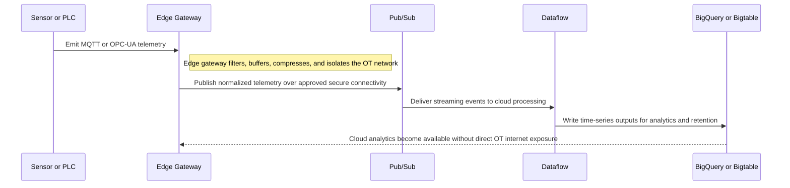
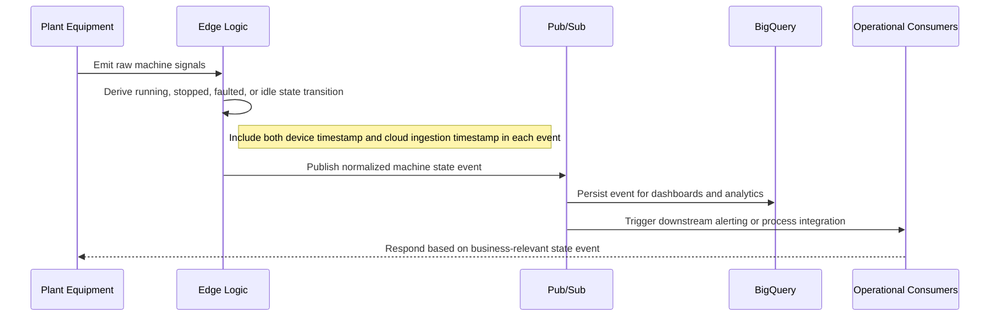

# Integration Reference Architecture — OT Data Streaming Patterns

## OT Data Streaming Patterns

**Version:** 0.1
**Status:** Draft – Pending Architecture Review
**Audience:** Solution Architects, Integration Engineers, Security and Operations Teams

---

## Document Introduction

### Purpose of Document

This document defines approved patterns for moving operational technology data from plant environments into the Entegris enterprise data platform. It helps architects balance industrial protocol realities, edge processing, and cloud-side analytics requirements.

- The value of the pattern is speed to execution — leveraging what others have done before and quickly achieving business outcomes
- A pattern is best expressed as: When to use, When Not to use certain technologies/approaches
- This document is for designers and architects who need to stream plant-floor telemetry and state events into enterprise platforms without weakening IT/OT boundaries or losing data fidelity
- If implemented properly, these patterns enable you to get to production as fast as possible and have the most stable, scalable, and maintenance-free set of applications possible

### Scope and Applicability

These patterns cover OT telemetry and machine-state event flows from industrial environments to GCP analytics services.

- Sensor telemetry streaming from OT protocols through edge gateways into Pub/Sub and analytical storage
- Machine state event propagation from plant equipment into enterprise monitoring and analytics pipelines

**Environments:**

- Hybrid
- Cloud

### Intended Audience

- Solution Architects
- OT Engineers
- Data Engineers
- Security and Operations Teams

---

## Context

- IT/OT security boundary is mandatory - OT networks must be air-gapped from internet; edge gateways bridge the gap with protocol translation and firewall controls
- MQTT and OPC-UA are the approved protocol families for plant-floor telemetry and machine data exchange
- Edge gateways must handle filtering, buffering, compression, and protocol translation before cloud delivery
- Pub/Sub is the standard cloud-side event bus for OT streaming workloads

### Why Use These Patterns

- Reduce cost through consolidation of functionality
- Agility through solutions based on a set of services that supports restructuring and reconfiguration of business processes
- Time-to-market through business-aligned solutions
- Alignment between IT and business goals, enabling re-use over time

---

## Architecture Principles

### Enterprise Principles

- Loosely Coupled and Interoperable Solutions
- Remove Friction
- Keep It Simple

### Domain-Specific Principles

- OT and IT Architecture Convergence
- Observability and Reliability by Design
- Data Quality at the Source

### Security Principles

- Security and Privacy by Design
- Defense in Depth
- Security Assurance Through Least Privilege

---

## High-Level Solution Patterns

| Solution | When to Use | When Not to Use |
|---|---|---|
| Sensor Telemetry Streaming |• Need continuous telemetry from sensors or PLC-connected devices • High-frequency measurements must be buffered and forwarded through an edge layer|• The data is a low-frequency business event better handled as a standard application integration • The source cannot provide stable telemetry sampling or timestamp data|
| Machine State Event Pattern |• Need business-relevant state changes such as start, stop, fault, or idle events • Event payloads are smaller and semantically meaningful|• The primary requirement is full-fidelity high-frequency telemetry retention • State transitions cannot be derived or emitted reliably from the edge layer|

---

## Pattern Selection Matrix

| Scenario Cue | Source Protocol | Frequency | Direction | Recommended Pattern | Notes |
| --- | --- | --- | --- | --- | --- |
| Continuous vibration or temperature readings | MQTT or OPC-UA | High-frequency stream | OT → GCP | Sensor Telemetry Streaming | Deploy edge agents to aggregate samples into 1-second batches before sending to Pub/Sub |
| Machine cycle start/stop/fault events | OPC-UA or edge-derived events | Event-driven | OT → GCP | Machine State Event Pattern | Publish events to Pub/Sub with equipment_id and fab_location attributes for downstream analytics filtering |

---

## Canonical Patterns

### Sensor Telemetry Streaming

| Area | Description |
|---|---|
| **Context** | Plant-floor devices produce continuous telemetry that must reach the enterprise data platform for monitoring and analytics. The OT environment cannot connect directly to the internet and may experience intermittent connectivity. |
| **Problem** | How do we stream high-frequency OT telemetry to GCP without exposing the OT network directly or overwhelming downstream analytics platforms? |
| **Solution** | • Collect MQTT or OPC-UA telemetry at an edge gateway that performs filtering, buffering, compression, and protocol translation • Publish the normalized stream from the edge boundary to Pub/Sub over approved secure connectivity and process it in the cloud • Store time-series outputs in BigQuery for analytics and evaluate Bigtable for very high-frequency raw telemetry retention needs |
| **Benefits** | • Protects the OT network while still enabling enterprise analytics • Improves resilience during intermittent connectivity through edge buffering • Scales telemetry processing using standard GCP event services |
| **Considerations** | • Downsampling and retention rules are required to manage cost and downstream usability • Device-local and ingestion timestamps must both be preserved for late-arrival handling |

### Machine State Event Pattern

| Area | Description |
|---|---|
| **Context** | Plant equipment emits or can derive meaningful state transitions such as running, stopped, faulted, or idle. Enterprise users need operational awareness more than raw signal-level detail. |
| **Problem** | How do we send machine state changes into enterprise platforms as reliable events while preserving OT security boundaries? |
| **Solution** | • Detect or derive machine state transitions at the edge using MQTT, OPC-UA, or gateway logic close to the equipment • Publish normalized state events to Pub/Sub with both device and ingestion timestamps and sufficient asset identity metadata • Route events to BigQuery or operational consumers for dashboards, alerting, and downstream process integration |
| **Benefits** | • Converts noisy signal data into business-relevant operational events • Improves responsiveness for monitoring and exception handling • Reduces storage and processing overhead compared with full-fidelity telemetry everywhere |
| **Considerations** | • State definitions must be standardized across plants or assets to support enterprise reporting • Edge logic changes should be governed carefully because they influence downstream business meaning |

## Sequence Diagrams

### Sensor Telemetry Streaming Flow

### Machine State Event Pattern Flow

---

## Tips and Best Practices

- Use Pub/Sub for OT sensor data under 10K msgs/sec; evaluate Kafka for higher volume fab lines
- Store OT credentials in GCP Secret Manager with automatic rotation every 90 days
- Implement schema validation in Dataflow before landing in BigTable to catch sensor drift
- Partition BigQuery tables by measurement_timestamp_utc for efficient time-range queries
- Log all OT integration errors to Cloud Logging with equipment_id and fab_location tags
