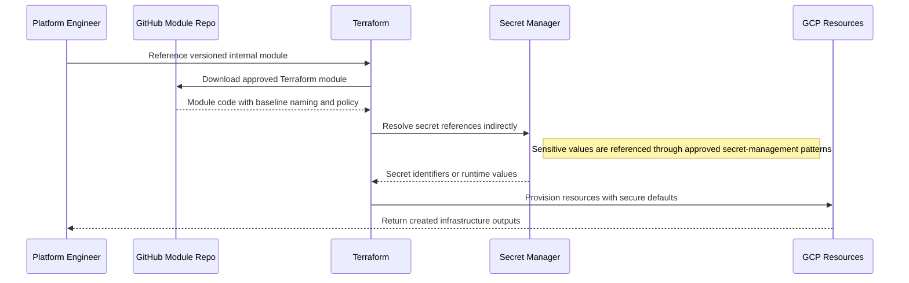
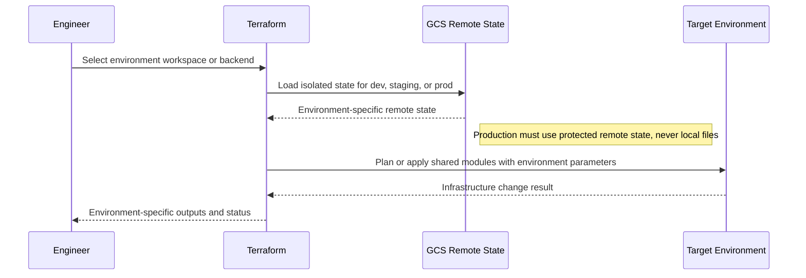
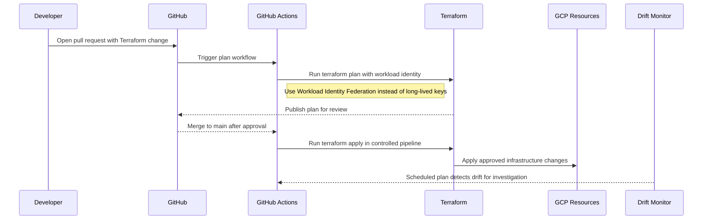

# Reference Architecture — Terraform Infrastructure Patterns

## Terraform Infrastructure Patterns

**Version:** 0.1
**Status:** Draft – Pending Architecture Review
**Audience:** Solution Architects, Integration Engineers, Security and Operations Teams

---

## Document Introduction

### Purpose of Document

This document defines approved Terraform patterns for provisioning and operating Entegris cloud resources. It gives teams a repeatable model for reusable modules, environment isolation, and pipeline-driven infrastructure changes.

- The value of the pattern is speed to execution — leveraging what others have done before and quickly achieving business outcomes
- A pattern is best expressed as: When to use, When Not to use certain technologies/approaches
- This document is for designers and architects who need to provision and change cloud infrastructure using approved infrastructure-as-code practices instead of manual console work
- If implemented properly, these patterns enable you to get to production as fast as possible and have the most stable, scalable, and maintenance-free set of applications possible

### Scope and Applicability

These patterns cover Terraform usage for shared modules, environment separation, and CI/CD execution across Entegris cloud estates.

- Provisioning GCP and related cloud resources through version-controlled Terraform code
- Running plan, apply, and drift-detection workflows through GitHub Actions

**Environments:**

- Cloud
- Hybrid

### Intended Audience

- Solution Architects
- Platform Engineers
- DevOps Engineers
- Security and Operations Teams

---

## Context

- Production state must be stored remotely in GCS and never on local developer machines
- Reusable modules reduce copy-paste infrastructure and drive consistent security controls
- Environment separation must be explicit so dev, staging, and prod changes can be promoted safely
- GitHub Actions is the standard execution path for plan, apply, and drift detection

### Why Use These Patterns

- Reduce cost through consolidation of functionality
- Agility through solutions based on a set of services that supports restructuring and reconfiguration of business processes
- Time-to-market through business-aligned solutions
- Alignment between IT and business goals, enabling re-use over time

---

## Architecture Principles

### Enterprise Principles

- Keep It Simple
- Automate Where Possible
- Think Big and Execute Rapidly

### Domain-Specific Principles

- Cloud-Smart by Default
- Platform Over Point Solutions
- Architecture Governance Through ARB and TRB

### Security Principles

- Security and Privacy by Design
- Security Assurance Through Least Privilege
- Defense in Depth

---

## High-Level Solution Patterns

| Solution | When to Use | When Not to Use |
|---|---|---|
| Module Pattern |• Need reusable infrastructure blocks with consistent policy and naming • Several teams provision the same resource type repeatedly|• The component is a one-off script that no team will reuse • Teams plan to duplicate resource definitions rather than manage a module lifecycle|
| Environment Workspace Pattern |• Need a clear separation strategy for dev, staging, and prod state • The same infrastructure design must be promoted across environments|• Environment boundaries are unclear or intentionally mixed • State isolation cannot be managed safely|
| CI/CD-driven IaC Pattern |• Need governed plan and apply execution through pull requests and merges • Require automated review, policy checks, and drift detection|• Teams expect to run production applies manually from laptops • Infrastructure changes do not pass through protected branches|

---

## Pattern Selection Matrix

| Scenario Cue | Change Scope | Environment Isolation | Execution Flow | Recommended Pattern | Notes |
| --- | --- | --- | --- | --- | --- |
| Provisioning standard Cloud Run services repeatedly | Reusable resource pattern | Shared across multiple environments | GitHub → Terraform → GCP | Module Pattern | Publish modules to internal GitHub; version with semantic tags (v1.2.3) for change control |
| Managing separate dev, staging, and prod projects | Environment-specific deployment | Distinct state per environment | GitHub → Terraform → GCP | Environment Workspace Pattern | Store Terraform state in GCS with versioning enabled; use separate buckets per environment |
| Applying reviewed infrastructure changes | Controlled release change | Promotion through protected branches | GitHub Actions → Terraform plan/apply | CI/CD-driven IaC Pattern | Use Sentinel or OPA policies to enforce required labels, encryption, and IAM guardrails |

---

## Canonical Patterns

### Module Pattern

| Area | Description |
|---|---|
| **Context** | Many Entegris teams provision the same classes of cloud resources and need a consistent secure baseline. Reusable modules provide one place to encode naming, policy, and standard settings. |
| **Problem** | How do we avoid copy-paste Terraform while still letting teams provision resources quickly and consistently? |
| **Solution** | • Create reusable Terraform modules per resource type and version them in an internal GitHub-backed module repository • Embed naming rules such as {env}-{region}-{resource-type}-{purpose} and baseline security settings inside the module • Reference secrets indirectly through approved secret-management patterns instead of hardcoding sensitive values in module variables |
| **Benefits** | • Improves consistency and reduces repeated design effort across teams • Makes upgrades and policy improvements easier to distribute through versioned modules • Accelerates delivery by giving teams approved building blocks |
| **Considerations** | • Modules need owners, semantic versioning, and change communication to remain useful • Overly generic modules can become hard to understand and harder to adopt |

### Environment Workspace Pattern

| Area | Description |
|---|---|
| **Context** | A solution must promote infrastructure across development, staging, and production environments. Teams need a clean way to isolate state and avoid accidental cross-environment changes. |
| **Problem** | How do we separate environment state and configuration so promotion is controlled and production remains protected? |
| **Solution** | • Use Terraform workspaces or clearly separated state backends in GCS to isolate environment deployments • Parameterize environment-specific values while preserving the same core module composition across stages • Keep remote state protected and never rely on local state files for production environments |
| **Benefits** | • Reduces accidental changes across environments • Supports predictable promotion from dev to staging to prod • Keeps production infrastructure state durable, shared, and recoverable |
| **Considerations** | • Workspace naming and variable management must remain simple enough for operators to reason about quickly • Separate state is safer than overloaded conditional logic inside one monolithic configuration |

### CI/CD-driven IaC Pattern

| Area | Description |
|---|---|
| **Context** | Infrastructure changes must be reviewed, planned, and applied through the same governed delivery path used for application code. The organization also needs continuous detection of drift from unauthorized manual changes. |
| **Problem** | How do we make infrastructure delivery auditable and repeatable while detecting production drift early? |
| **Solution** | • Run Terraform plan in GitHub Actions for every pull request and expose the results for review before merge • Run Terraform apply only after merge to main through a controlled pipeline with environment-specific approvals as needed • Schedule recurring Terraform plan jobs to detect drift and investigate any manual resource changes immediately |
| **Benefits** | • Creates a reviewable infrastructure change record tied to source control • Reduces the risk of manual mistakes and hidden drift • Supports policy enforcement and repeatable promotion across environments |
| **Considerations** | • Pipeline credentials and workload identity setup must be designed carefully so CI can act without long-lived keys • Teams must resist emergency console changes that bypass the approved IaC path |

## Sequence Diagrams

### Module Pattern Flow

### Environment Workspace Pattern Flow

### CI/CD-driven IaC Pattern Flow

---

## Tips and Best Practices

- Store Terraform state in GCS with versioning enabled and encrypted at rest
- Use separate GCP service accounts per environment (dev, test, prod) with least privilege IAM
- Run Terraform plan in CI on every pull request; require approval before merge to main
- Implement Terraform Cloud or Cloud Build for remote execution; never run locally for prod changes
- Use Sentinel policies or OPA to enforce guardrails like required labels and encryption
