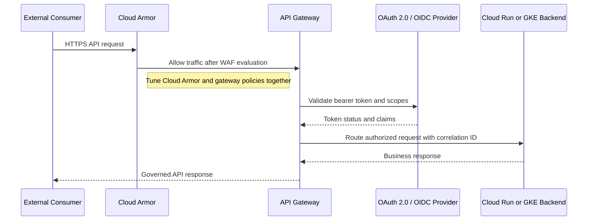
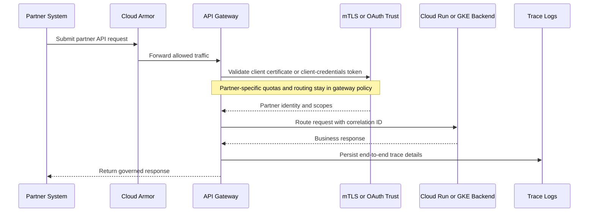
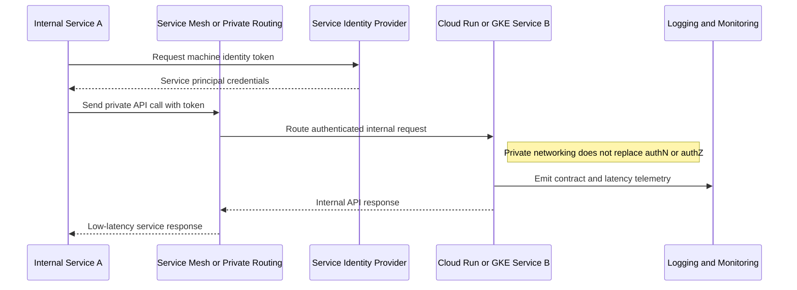

# API Ingress Patterns

## API Ingress Patterns

**Version:** 0.1
**Status:** Draft – Pending Architecture Review
**Audience:** Solution Architects, Integration Engineers, Security and Operations Teams

---

## Document Introduction

### Purpose of Document

This document defines approved patterns for inbound API traffic into Entegris platforms on GCP. It gives architects a consistent way to expose public, partner, and internal APIs while preserving security and operational control.

- The value of the pattern is speed to execution — leveraging what others have done before and quickly achieving business outcomes
- A pattern is best expressed as: When to use, When Not to use certain technologies/approaches
- This document is for designers and architects who need to publish or consume inbound APIs with the correct gateway, protection, and authentication approach
- If implemented properly, these patterns enable you to get to production as fast as possible and have the most stable, scalable, and maintenance-free set of applications possible

### Scope and Applicability

These patterns cover inbound REST-first API exposure for internet-facing, partner, and internal service traffic.

- External consumer access to Entegris APIs through protected ingress services
- Partner and internal application-to-application calls into Cloud Run or GKE backends

**Environments:**

- Cloud
- Hybrid

### Intended Audience

- Solution Architects
- Integration Engineers
- Application Developers
- Security and Operations Teams

---

## Context

- Cloud Armor is mandatory in front of every internet-facing endpoint and must not be bypassed
- Published APIs require an OpenAPI 3.1 contract and consistent gateway policy enforcement
- Authentication differs by consumer type: OAuth 2.0/OIDC for user-facing flows and service principal credentials for machine-to-machine access
- Gateway capabilities such as throttling, routing, and analytics must be centralized in the approved API management layer

### Why Use These Patterns

- Reduce cost through consolidation of functionality
- Agility through solutions based on a set of services that supports restructuring and reconfiguration of business processes
- Time-to-market through business-aligned solutions
- Alignment between IT and business goals, enabling re-use over time

---

## Architecture Principles

### Enterprise Principles

- Loosely Coupled and Interoperable Solutions
- Remove Friction
- Keep It Simple

### Domain-Specific Principles

- Internet and API First
- Applications Expose Stable, Documented Interfaces
- Observability and Reliability by Design

### Security Principles

- Security and Privacy by Design
- Defense in Depth
- Security Assurance Through Least Privilege

---

## High-Level Solution Patterns

| Solution | When to Use | When Not to Use |
|---|---|---|
| Public API Ingress |• Need internet-facing access for broad external consumers • Require WAF, DDoS protection, and centralized policy enforcement|• Traffic is private-only inside the enterprise network • The API is not ready for formal external publishing and support|
| Partner API Ingress |• Need controlled access for a known external organization • Require stronger trust controls such as mTLS and scoped OAuth|• Consumers are anonymous or open public users • The partner cannot support required certificate or token standards|
| Internal Service-to-Service |• Need service calls between Entegris-managed workloads • Traffic stays on approved private or internal paths|• The API must be exposed to internet consumers • A partner or external tenant needs direct access|

---

## Pattern Selection Matrix

| Scenario Cue | Consumer Type | Exposure | Direction | Recommended Pattern | Notes |
| --- | --- | --- | --- | --- | --- |
| Developer-facing external API | Public external consumer | Internet-facing | Consumer → GCP | Public API Ingress | Use Cloud Armor with approved API gateway (Apigee or Kong per TRB decision); rate limit to 100 req/sec per API key |
| Supplier integration endpoint | Named partner organization | Internet-facing | Partner → GCP | Partner API Ingress | Implement mTLS with partner-specific client certificates stored in Certificate Manager |
| Internal order service calling pricing service | Entegris application | Private/internal | App → App | Internal Service-to-Service | Use Identity-Aware Proxy (IAP) for internal APIs requiring Entegris SSO authentication |

---

## Canonical Patterns

### Public API Ingress

| Area | Description |
|---|---|
| **Context** | Entegris exposes a REST API to external consumers over the internet. The API must be resilient, contract-driven, and protected by standard perimeter controls. |
| **Problem** | How do we expose an external API without letting consumers bypass mandatory protection, governance, and backend isolation controls? |
| **Solution** | • Front the endpoint with Google Cloud Armor and an approved API gateway platform such as Apigee or Kong once selected by Entegris • Publish an OpenAPI 3.1 specification and enforce authentication, quotas, and routing policies at the gateway layer • Route traffic to a Cloud Run or GKE backend behind the load balancer so the application is not directly exposed to the internet |
| **Benefits** | • Applies a consistent security and governance posture to all external APIs • Supports rate limiting, analytics, and lifecycle management from a single control point • Decouples consumer-facing contracts from backend implementation details |
| **Considerations** | • User-facing APIs should use OAuth 2.0/OIDC rather than ad hoc authentication schemes • Cloud Armor rules and gateway policies must be tuned together to avoid blocking legitimate traffic |

### Partner API Ingress

| Area | Description |
|---|---|
| **Context** | A known partner system needs controlled access to a business API hosted by Entegris. The relationship requires tighter identity controls and supportable operating boundaries. |
| **Problem** | How do we let a partner call an Entegris API while enforcing stronger trust, contractual throttling, and support visibility? |
| **Solution** | • Expose the API through Cloud Armor and the approved gateway with partner-specific routing and policy enforcement • Require mTLS or OAuth 2.0 client credentials with a service principal based trust model appropriate to the partner integration • Route the request to a backend on Cloud Run or GKE and include correlation IDs for end-to-end tracing |
| **Benefits** | • Supports secure partner onboarding with explicit policy boundaries • Makes quota, certificate, and scope management visible and auditable • Keeps backend services isolated from direct partner connectivity |
| **Considerations** | • Certificate lifecycle and partner credential rotation need an agreed operational process • Partner-specific exceptions should be modeled as gateway policy, not custom backend logic |

### Internal Service-to-Service

| Area | Description |
|---|---|
| **Context** | Two Entegris-managed workloads need machine-to-machine API communication inside the enterprise boundary. The goal is low-latency access without unnecessary internet exposure. |
| **Problem** | How do we support internal API calls while preserving service identity, least privilege, and operational traceability? |
| **Solution** | • Use approved internal routing such as service mesh or direct private access to a Cloud Run or GKE backend • Authenticate machine-to-machine traffic with service principal client credentials or equivalent non-user identity controls • Apply contract, logging, and monitoring standards even when the API is not internet-facing |
| **Benefits** | • Reduces exposure surface compared with public ingress patterns • Supports efficient low-latency calls between internal services • Preserves identity-based authorization and operational observability |
| **Considerations** | • Internal APIs still need versioning and OpenAPI contracts when they are reused across teams • Do not treat private networking as a substitute for authentication and authorization |

## Sequence Diagrams

### Public API Ingress Flow

### Partner API Ingress Flow

### Internal Service-to-Service Flow

---

## Tips and Best Practices

- Use Cloud Armor WAF policies managed in Terraform, never manual Console changes
- Store API keys in GCP Secret Manager and rotate every 90 days minimum
- Log all API requests to Cloud Logging with correlation_id for distributed tracing
- Set Cloud Armor rate limits to 100 requests/sec per client IP by default
- Use Identity-Aware Proxy (IAP) for internal APIs requiring Entegris SSO authentication
