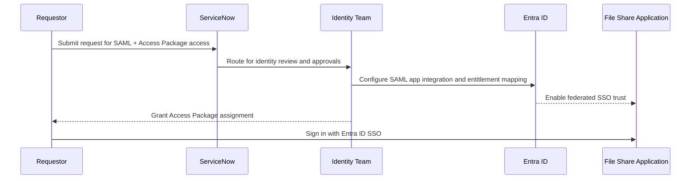
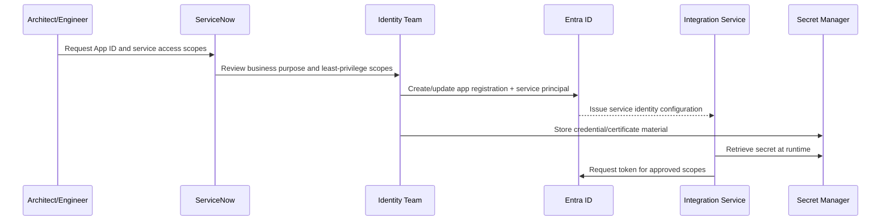
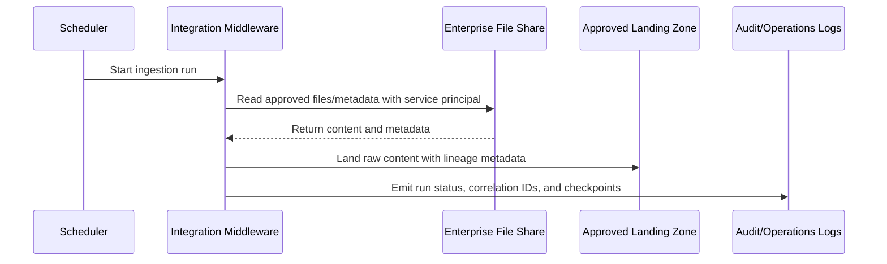

# Integration Reference Architecture — File Share Access and Integration Patterns

## File Share Access and Integration Patterns
- External Document Sharing (OneDrive and Dropbox)

**Version:** 0.1
**Status:** Draft – Candidate for TRB Review
**Audience:** Solution Architects, Application Engineers, Identity and Access Teams, Security and Operations Teams

---

## Document Introduction

### Purpose of Document

This document defines an initial Entegris pattern for enterprise file share access and integration. It gives teams a standard path to onboard a file-share-enabled application with SSO, entitlement governance, and controlled application access.

- The value of the pattern is speed to execution — leveraging what others have done before and quickly achieving business outcomes
- A pattern is best expressed as: When to use, When Not to use certain technologies/approaches
- This document is for designers and architects who need to enable user and system access to enterprise file shares without bypassing identity, security, and governance controls
- If implemented properly, these patterns enable teams to move quickly while preserving least privilege, auditability, and supportability

### Scope and Applicability

These patterns cover user and application access to enterprise file share platforms with Entra ID, SAML SSO, Access Packages, and governed service-to-service integration.

- Human user access through SAML SSO and Access Package assignment
- Application access through Entra ID app registration, App ID, and service principal permissions
- Optional ingestion of file-share content into enterprise platforms using approved middleware

**Environments:**

- SaaS
- Cloud
- Hybrid

### Intended Audience

- Solution Architects
- Application Engineers
- Integration Engineers
- Identity and Access Teams
- Security and Operations Teams

---

## Context

- New app access to file-share resources requires an App ID (Entra ID app registration) if one does not already exist
- Human user access must use federated SSO through Entra ID and governed entitlement assignment through Access Packages
- Service-to-service access must use a managed application identity and least-privilege scopes; shared credentials and user accounts are not approved
- Requests for SAML, Access Package, and onboarding workflow are routed through standard ServiceNow intake with Identity team guidance
- Human review remains required for material data publication or externally shared outputs generated from file-share content

### Why Use These Patterns

- Standardizes onboarding steps across architecture, identity, and operations
- Reduces delays from ad hoc access requests and one-off identity configurations
- Improves auditability of who can access what, and why
- Lowers security risk through least-privilege and centralized identity governance

---

## Architecture Principles

### Enterprise Principles

- Keep It Simple
- Reuse Shared Application Services First
- Remove Friction

### Domain-Specific Principles

- Applications Expose Stable, Documented Interfaces
- Single Source of Truth
- Humans in the Loop for Material Decisions

### Security Principles

- Security and Privacy by Design
- Security Assurance Through Least Privilege
- Defense in Depth

---

## Guardrail Summary

This pattern is constrained by the following guidance:

- User-facing authentication must be federated SSO through Entra ID
- Entitlements must be governed through Access Packages and reviewable group-based access
- Application integration must use an App ID and service principal with narrowly scoped permissions
- No shared user credentials, no hardcoded secrets, and no unmanaged local bypass
- Access grants, application permissions, and administrative actions must be auditable

---

## High-Level Solution Patterns

| Solution | When to Use | When Not to Use |
|---|---|---|
| SAML + Access Package User Access Pattern |• Users need interactive file-share access in a browser or enterprise app • Access must be approved, reviewable, and revocable through standard governance |• Team wants direct local accounts or unmanaged identity flows • Access cannot be mapped to reviewable business roles |
| App ID Service Integration Pattern |• An application needs machine access to file-share data for read/write automation • Permissions can be scoped to defined sites, folders, or resources |• Integration requires broad tenant-wide permissions without business justification • Team plans to use a user credential, shared account, or embedded secret |
| Managed File Share Ingestion Pattern |• Need scheduled or event-driven extraction of approved file-share content into enterprise data platforms • Team needs retry, logging, and checkpointing controls |• Data movement bypasses approved middleware, security, or landing-zone controls • Team cannot support operational monitoring and replay |

---

## Pattern Selection Matrix

| Scenario Cue | Access Type | Identity Method | Recommended Pattern | Notes |
| --- | --- | --- | --- | --- |
| Employees need role-based access to a file-share-backed app | Human interactive | Entra ID SAML SSO + Access Package | SAML + Access Package User Access Pattern | Access Package assignment should map to business role and owner-approved entitlement |
| Backend service needs file metadata and content for processing | Service-to-service | Entra ID App ID + service principal | App ID Service Integration Pattern | Request App ID early; document scopes and owner in ServiceNow request |
| Team needs periodic landing of file-share content for analytics | Batch/event integration | Service principal + approved middleware | Managed File Share Ingestion Pattern | Land raw content first, keep replayability, and monitor correlation IDs |

---

## Canonical Patterns

### SAML + Access Package User Access Pattern

| Area | Description |
|---|---|
| **Context** | A business app needs user access to file-share content, and access must be granted by business role with centralized identity governance. |
| **Problem** | How do we enable fast user onboarding while enforcing enterprise SSO and entitlement controls? |
| **Solution** | • Integrate the application with Entra ID for SAML SSO and disable local authentication paths • Define role-based groups and publish Access Packages aligned to business roles and approval flows • Route onboarding via ServiceNow request with Identity team review, including access owner, approver, and periodic recertification requirements |
| **Benefits** | • Consistent user login and lifecycle management across enterprise applications • Reviewable and revocable access through centralized entitlement governance • Lower operational risk from ad hoc manual user provisioning |
| **Considerations** | • Role and entitlement design quality drives usability and supportability • Group and Access Package ownership must be explicit to avoid stale access |

### App ID Service Integration Pattern

| Area | Description |
|---|---|
| **Context** | An application or integration service requires non-interactive access to file-share resources. |
| **Problem** | How do we provide machine access without using user credentials or over-scoped permissions? |
| **Solution** | • Create or reuse a governed Entra ID app registration (App ID) with named ownership and business purpose • Use service principal authentication and request only required permissions for the specific file-share scope • Store client credentials or certificates in approved secret management and implement rotation, logging, and access review controls |
| **Benefits** | • Eliminates dependency on personal user accounts for system integrations • Enables least-privilege, auditable, and revocable service access • Aligns service authentication to enterprise identity and risk processes |
| **Considerations** | • Permission expansion requires explicit review and change control • Certificate and secret rotation must be operationalized before go-live |

### Managed File Share Ingestion Pattern

| Area | Description |
|---|---|
| **Context** | Teams need approved file-share content moved into enterprise processing platforms for analytics, workflow, or indexing. |
| **Problem** | How do we ingest content reliably while preserving security boundaries and replayability? |
| **Solution** | • Use approved middleware to orchestrate extraction, checkpointing, retries, and failure handling • Authenticate through App ID service principal and pull only approved paths/content classes • Land raw content in the approved landing zone first, then perform downstream transformation with lineage metadata |
| **Benefits** | • Improves reliability through standardized retry and checkpoint controls • Preserves traceability from source file to downstream record • Reduces custom one-off ingestion scripts and support burden |
| **Considerations** | • Event and delta logic requires careful handling of deletes, renames, and replay windows • Data classification and retention obligations apply to copied content |

---

## Required Controls

| Control Area | Required Direction for File Share Patterns |
| --- | --- |
| **Authentication** | Use Entra ID SAML SSO for users and service principal identity for machine integrations; no local auth schemes. |
| **Entitlement Governance** | Use Access Packages and role-based group assignment with owner/approver accountability and periodic reviews. |
| **Application Identity** | Ensure App ID exists with named owner, documented purpose, and scoped permissions. |
| **Secrets Management** | Store credentials/certificates in approved secret management; no hardcoded or shared credentials. |
| **Least Privilege** | Grant only required scopes/resources; avoid wildcard or tenant-wide permissions unless explicitly approved. |
| **Logging and Audit** | Log access requests, grants, scope changes, and integration actions with correlation IDs; do not log sensitive content bodies by default. |
| **Data Handling** | Apply data classification, retention, and minimization; do not move restricted data without explicit approval. |
| **Operational Support** | Define ownership for access lifecycle, secret/cert rotation, incident response, and decommissioning. |

---

## Sequence Diagrams

### User Access Onboarding (SAML + Access Package)

### App ID Creation and Service Integration

### Managed Ingestion Flow

---

## Implementation Guidance

### Preferred Approach

- Confirm whether an App ID already exists before creating a new one
- Start with the minimal set of SAML attributes, access roles, and permissions needed for initial use
- Submit one ServiceNow request for SAML/Access Package and one for App ID/service scopes if needed
- Partner early with Identity contacts to define role model, approvers, and recertification cycle

### Explicit Non-Goals

- This pattern does not permit bypassing enterprise SSO with local username/password
- This pattern does not permit shared technical accounts or hardcoded credentials
- This pattern does not authorize broad tenant-wide permissions without explicit risk review
- This pattern does not replace human review for material content publication decisions

### Related Knowledge Base Guidance

- Access & Authorization Pattern
- SharePoint Online Data Ingestion Pattern
- Security Principles
- AI Policy
- Architecture Assurance Guardrail Framework

---

## Tips and Best Practices

- Request App ID and SAML/Access Package early in project kickoff to avoid downstream delay
- Keep a single source of truth for access roles, approvers, and entitlement rationale
- Use group-based authorization in the app and avoid user-by-user exception logic
- Add periodic access recertification and permission drift checks to operating routines
- Track onboarding lead time as a metric to improve TRB readiness over time

## Sources

- [Architecture Patterns Defined](../../context/05-architecture-patterns-and-template.md)
- [Architecture Assurance Guardrail Framework](../../context/07-architecture-assurance-guardrails.md)
- [Access & Authorization](../application/access-authorization-pattern.md)
- [SharePoint Online Data Ingestion Patterns](./sharepoint-ingestion-pattern.md)
- [Security Principles](../../principles/security-principles.md)
- [Entegris Artificial Intelligence (AI) Policy](../../policies/cybersecurity/ai-policy.md)
