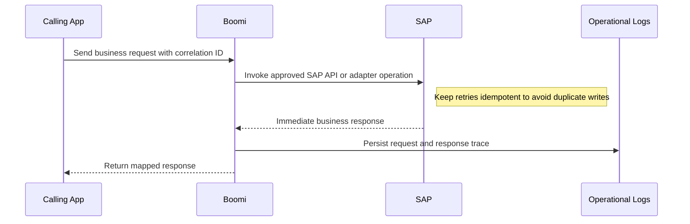
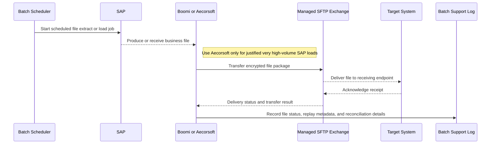
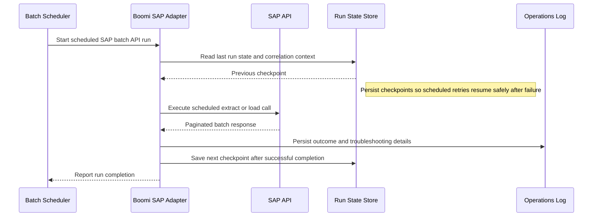
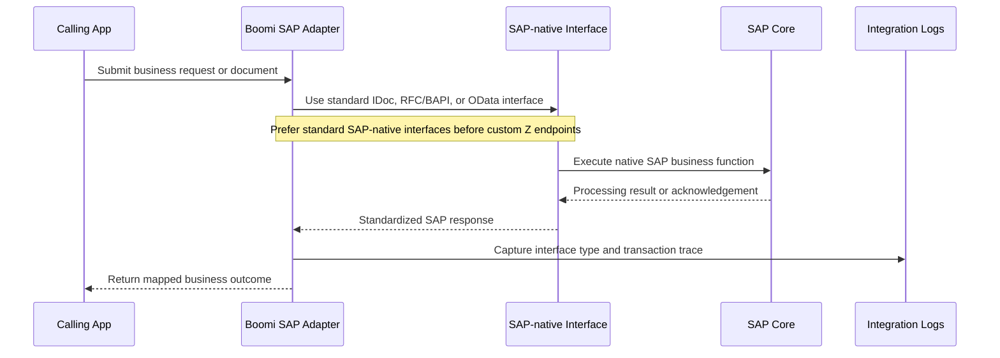
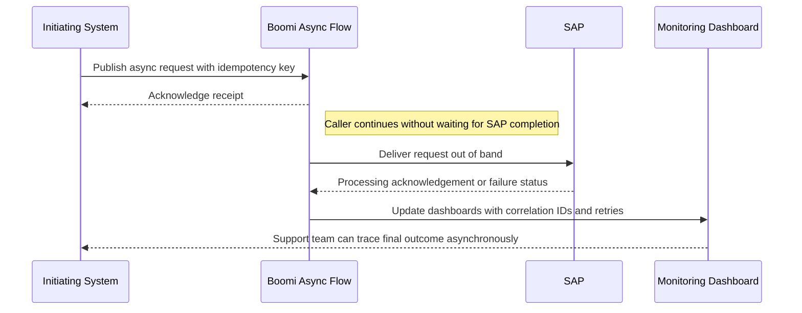

# Integration Reference Architecture — SAP Integration Patterns

## SAP Integration Patterns

**Version:** 0.1
**Status:** Draft – Pending Architecture Review
**Audience:** Solution Architects, Integration Engineers, Security and Operations Teams

---

## Document Introduction

### Purpose of Document

This document defines approved patterns for integrating Entegris applications and platforms with SAP systems. It helps teams choose the right SAP interaction style based on transactionality, volume, latency, and SAP-native interface options.

- The value of the pattern is speed to execution — leveraging what others have done before and quickly achieving business outcomes
- A pattern is best expressed as: When to use, When Not to use certain technologies/approaches
- This document is for designers and architects who need to integrate with SAP using the right middleware, protocol, and operational model for each business scenario
- If implemented properly, these patterns enable you to get to production as fast as possible and have the most stable, scalable, and maintenance-free set of applications possible

### Scope and Applicability

These patterns cover synchronous, batch, SAP-native, and asynchronous integration approaches between SAP and the broader Entegris estate.

- SAP request/reply, batch, and event-style integrations mediated through approved middleware
- Use of SAP-native interfaces such as IDoc, RFC/BAPI, and OData for standardized connectivity

**Environments:**

- Cloud
- Hybrid

### Intended Audience

- Solution Architects
- Integration Engineers
- SAP Engineers
- Security and Operations Teams

---

## Context

- Boomi is the standard middleware for SAP integration across most scenarios
- Aecorsoft is approved only for large-volume SAP data loads where Boomi is not appropriate
- Boomi SAP adapters should be preferred over custom connectivity when a standard interface is available
- BTP may be used for more complex custom interfaces that cannot be met with standard adapter patterns

### Why Use These Patterns

- Reduce cost through consolidation of functionality
- Agility through solutions based on a set of services that supports restructuring and reconfiguration of business processes
- Time-to-market through business-aligned solutions
- Alignment between IT and business goals, enabling re-use over time

---

## Architecture Principles

### Enterprise Principles

- Loosely Coupled and Interoperable Solutions
- Platform Over Point Solutions
- Keep It Simple

### Domain-Specific Principles

- Single ERP, Minimal Customization
- Integration Through Standard Middleware
- Single Source of Truth

### Security Principles

- Security and Privacy by Design
- Security Assurance Through Least Privilege
- Defense in Depth

---

## High-Level Solution Patterns

| Solution | When to Use | When Not to Use |
|---|---|---|
| Synchronous API (Request/Reply) |• Need immediate business response from SAP • Volume is moderate and user or process flow is latency-sensitive|• The use case is high-volume batch extraction • Long-running processing would cause timeouts or poor user experience|
| Batch SFTP (File-based Extract/Load) |• Need scheduled large-file exchange with SAP or adjacent systems • Payloads are naturally file-oriented|• The use case requires immediate interactive response • The data volume is so large that Aecorsoft should be used instead|
| Batch API (Scheduled Extract/Load) |• Need scheduled integration through API-style calls • Business latency is measured in batch windows|• Real-time transactional interaction is required • Repeated polling would create unnecessary load or poor fit|
| SAP IDoc / RFC / OData (SAP-native) |• Need a standard SAP-native interface for document, function, or REST-style integration • A Boomi SAP adapter or approved SAP capability exists|• Teams want to build custom Z endpoints without exhausting standard options • The interface style is mismatched to the SAP business object behavior|
| Asynchronous Pattern (Fire-and-forget / event-triggered) |• Need decoupled processing with eventual consistency • SAP does not need to respond in-line to the caller|• The business operation requires immediate synchronous confirmation • Consumers cannot handle eventual consistency or delayed failure handling|

---

## Pattern Selection Matrix

| Scenario Cue | Interaction Type | Volume | Direction | Recommended Pattern | Notes |
| --- | --- | --- | --- | --- | --- |
| Customer lookup during order entry | Synchronous request/reply | Low to moderate | App ↔ SAP | Synchronous API (Request/Reply) | Use Boomi SAP adapter with 30-second timeout; implement fallback to cached data for resilience |
| Large nightly material master extract | Batch file transfer | Very high | SAP → GCP | Batch SFTP (File-based Extract/Load) | Use Aecorsoft (not Boomi) when volume exceeds 100K records or 1GB file size |
| Scheduled pull of standard SAP dataset | Batch API polling | Moderate | SAP → GCP | Batch API (Scheduled Extract/Load) | Run during SAP batch windows (8pm-6am PST) to avoid peak production load |
| Standard order document exchange | SAP-native async or function call | Moderate | SAP ↔ Enterprise | SAP IDoc / RFC / OData (SAP-native) | Use standard IDoc types (ORDERS05, MATMAS05) before creating custom Z interfaces |
| Event-driven outbound notification | Asynchronous fire-and-forget | Moderate | SAP → Consumer | Asynchronous Pattern (Fire-and-forget / event-triggered) | Publish SAP events to Pub/Sub with message deduplication enabled to handle retries |

---

## Canonical Patterns

### Synchronous API (Request/Reply)

| Area | Description |
|---|---|
| **Context** | A business process or user interaction needs an immediate response from SAP before it can continue. The integration must be reliable enough for in-line execution. |
| **Problem** | How do we call SAP synchronously without bypassing middleware, losing observability, or creating duplicate transactional side effects? |
| **Solution** | • Use Boomi as the mediation layer for synchronous request/reply interactions between the caller and SAP • Prefer standard SAP interfaces exposed through approved adapters or APIs that match the required business function • Propagate correlation IDs and design retries carefully so transient failures do not create duplicate writes |
| **Benefits** | • Supports business flows that need immediate confirmation from SAP • Keeps middleware governance, logging, and policy enforcement in the path • Allows consistent operational support with traceable transaction context |
| **Considerations** | • Long-running SAP operations may not fit synchronous user or API timeout limits • Write operations must account for atomic commit behavior and safe retry design |

### Batch SFTP (File-based Extract/Load)

| Area | Description |
|---|---|
| **Context** | A SAP integration exchanges large datasets on a scheduled basis and file-oriented transfer is the natural contract. Operations teams need clear handoff points and reconciliation. |
| **Problem** | How do we move scheduled SAP files safely and at scale without forcing interactive or chatty API patterns onto a batch workload? |
| **Solution** | • Use a managed file exchange pattern mediated through the approved integration platform and secure transport such as SFTP • Select Aecorsoft only for large-volume SAP loads where Boomi is not the right operational or performance fit • Track file receipt, processing status, and replay metadata so batch support teams can reconcile each transfer |
| **Benefits** | • Fits large scheduled extracts and loads cleanly • Provides explicit operational checkpoints for reconciliation and reprocessing • Avoids forcing high-volume workloads through inappropriate synchronous designs |
| **Considerations** | • File contracts and encryption practices must be governed carefully with SAP and downstream owners • Very high-volume interfaces should be justified explicitly when selecting Aecorsoft over Boomi |

### Batch API (Scheduled Extract/Load)

| Area | Description |
|---|---|
| **Context** | A SAP dataset can be retrieved or loaded on a schedule through API-oriented interaction rather than file exchange. The business process tolerates batch latency. |
| **Problem** | How do we use scheduled SAP APIs efficiently without creating needless polling load or hiding failures in custom scripts? |
| **Solution** | • Use Boomi and the SAP adapter to execute scheduled extract or load operations against approved SAP APIs • Align schedules to business windows and API capacity so loads are predictable and supportable • Persist run state, correlation IDs, and response outcomes for replay and operational troubleshooting |
| **Benefits** | • Supports batch semantics while retaining API-level structure and middleware governance • Reduces the operational overhead of bespoke scripts • Improves consistency of logging, retry, and error routing |
| **Considerations** | • Polling schedules should be reviewed to ensure a true event or native SAP interface would not be a better fit • Large dataset pagination and timeout handling require careful design |

### SAP IDoc / RFC / OData (SAP-native)

| Area | Description |
|---|---|
| **Context** | The business object or process maps naturally to a standard SAP-native integration interface. Entegris wants to maximize supportability and minimize unnecessary custom SAP endpoints. |
| **Problem** | How do we choose and use the right SAP-native interface while preserving standardization and avoiding unnecessary custom development? |
| **Solution** | • Use Boomi SAP adapters with standard SAP-native interfaces such as IDoc for document exchange, RFC/BAPI for function calls, or OData for RESTful access • Select the interface style that best matches the business semantic and processing pattern rather than forcing one style everywhere • Avoid custom Z endpoints unless a documented business need remains after evaluating the standard SAP options and BTP alternatives |
| **Benefits** | • Improves compatibility with standard SAP capabilities and support models • Reduces custom integration maintenance over time • Helps align interface choice to native SAP business semantics |
| **Considerations** | • Teams need SAP-specific expertise to choose the right interface for each business object and transaction • Custom extensions should go through stronger architecture review because they increase lifecycle cost |

### Asynchronous Pattern (Fire-and-forget / event-triggered)

| Area | Description |
|---|---|
| **Context** | A process can continue without waiting for SAP to respond in-line and eventual consistency is acceptable. Decoupling improves resilience and throughput for the business flow. |
| **Problem** | How do we integrate with SAP asynchronously while preserving reliability, idempotency, and operational visibility? |
| **Solution** | • Publish the request or event through Boomi using an asynchronous design and let SAP process it out of band • Carry correlation IDs and idempotency keys so retries or duplicate deliveries can be detected safely • Monitor acknowledgements, failures, and compensating actions through structured logs and operational dashboards |
| **Benefits** | • Improves resilience by decoupling the initiating process from SAP availability and latency • Supports higher throughput for non-interactive workloads • Fits document-style or event-driven enterprise integration scenarios well |
| **Considerations** | • Business teams must understand and accept eventual consistency behavior • Failure handling requires clear ownership when the initiating caller is no longer waiting synchronously |

## Sequence Diagrams

### Synchronous API (Request/Reply) Flow

### Batch SFTP (File-based Extract/Load) Flow

### Batch API (Scheduled Extract/Load) Flow

### SAP IDoc / RFC / OData (SAP-native) Flow

### Asynchronous Pattern (Fire-and-forget / event-triggered) Flow

---

## Tips and Best Practices

- Store SAP credentials in GCP Secret Manager with automatic rotation every 90 days
- Use Aecorsoft for batch extracts exceeding 100K records; use Boomi for transactional flows under 10K records
- Log all IDoc and BAPI correlation IDs to Cloud Logging for SAP troubleshooting
- Land raw SAP payloads in GCS Bronze before any transformation to preserve audit trail
- Test SAP integrations in Sandbox first, then Dev, then Prod - never skip environments
