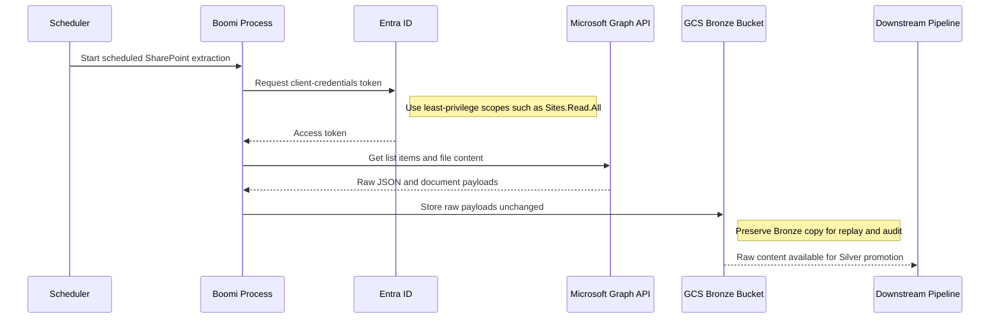
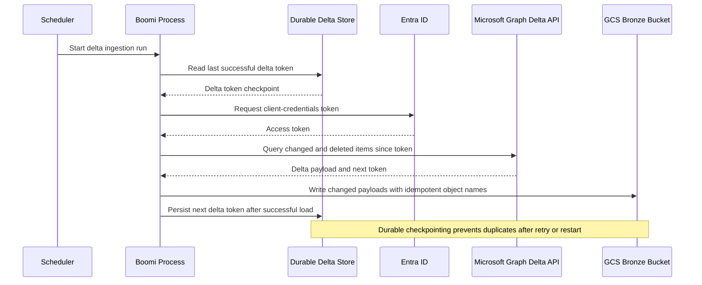
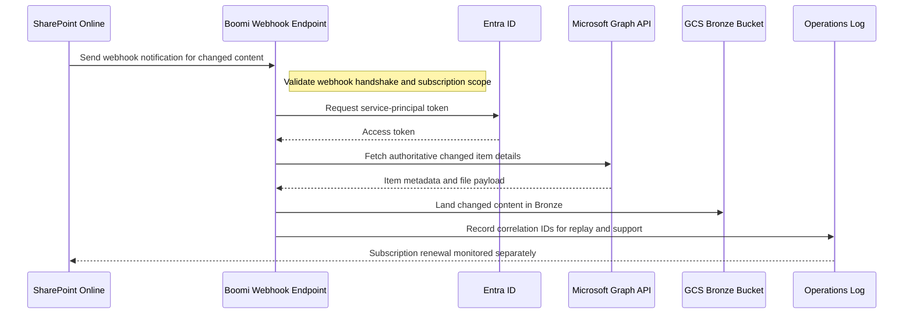

# SharePoint Online Data Ingestion

## SharePoint Online Data Ingestion Patterns

**Version:** 0.1
**Status:** Draft – Pending Architecture Review
**Audience:** Solution Architects, Integration Engineers, Security and Operations Teams

---

## Document Introduction

### Purpose of Document

This document defines approved patterns for ingesting SharePoint Online content into the Entegris GCP data platform using Microsoft Graph API and Boomi. It helps teams choose the fastest compliant path for list, library, and document ingestion.

- The value of the pattern is speed to execution — leveraging what others have done before and quickly achieving business outcomes
- A pattern is best expressed as: When to use, When Not to use certain technologies/approaches
- This document is for designers and architects who need to move SharePoint Online content into GCP without violating Entegris integration, identity, and landing-zone standards
- If implemented properly, these patterns enable you to get to production as fast as possible and have the most stable, scalable, and maintenance-free set of applications possible

### Scope and Applicability

These patterns cover SharePoint Online ingestion scenarios that must land raw data in Entegris-managed GCP services.

- Scheduled extraction of SharePoint lists, libraries, and document metadata
- Change-aware ingestion using Microsoft Graph delta queries and webhook notifications

**Environments:**

- SaaS
- Hybrid
- Cloud

### Intended Audience

- Solution Architects
- Integration Engineers
- Data Engineers
- Security and Operations Teams

---

## Context

- Entegris standardizes on Microsoft Graph API; direct SharePoint REST API usage is not approved
- Authentication must use an Entra ID app registration and service principal with client credentials grant, never a user account
- Boomi is the approved orchestration layer for retries, scheduling, and error handling
- All raw payloads and files must land first in a GCS Bronze bucket before downstream transformation

### Why Use These Patterns

- Reduce cost through consolidation of functionality
- Agility through solutions based on a set of services that supports restructuring and reconfiguration of business processes
- Time-to-market through business-aligned solutions
- Alignment between IT and business goals, enabling re-use over time

---

## Architecture Principles

### Enterprise Principles

- Loosely Coupled and Interoperable Solutions
- Platform Over Point Solutions
- Keep It Simple

### Domain-Specific Principles

- Integration Through Standard Middleware
- Data Quality at the Source
- Single Source of Truth

### Security Principles

- Security and Privacy by Design
- Security Assurance Through Least Privilege
- Defense in Depth

---

## High-Level Solution Patterns

| Solution | When to Use | When Not to Use |
|---|---|---|
| Batch Ingestion |• Need scheduled full or targeted extracts from lists and libraries • Freshness is hourly, daily, or otherwise time-based|• Need near-real-time updates • Cannot tolerate scanning unchanged items repeatedly|
| Incremental/Delta Ingestion |• Need changed items only to reduce API calls and processing cost • Can persist and manage the Microsoft Graph delta token|• Source objects do not support the needed delta query behavior • Team cannot operationally manage token lifecycle and replay logic|
| Event-triggered Ingestion |• Need rapid awareness of changes or uploads • Can manage SharePoint webhook subscription renewal and validation|• Need guaranteed delivery of full payload directly from the event • Source system or process cannot support webhook governance|

---

## Pattern Selection Matrix

| Scenario Cue | Frequency | Volume | Auth Method | Direction | Recommended Pattern | Notes |
| --- | --- | --- | --- | --- | --- | --- |
| Daily document archive from a library | Scheduled | Large | Entra ID service principal + client credentials | SharePoint → GCP | Batch Ingestion | Use Boomi with Graph API batch endpoints when fetching >1000 items to stay under throttling limits |
| Hourly updates for active list items | Scheduled delta | Small to medium | Entra ID service principal + client credentials | SharePoint → GCP | Incremental/Delta Ingestion | Store delta tokens in Boomi Process Property or GCS to enable replay after failures |
| Immediate notification when a file is added | Event-triggered | Small to medium | Entra ID service principal + client credentials | SharePoint → GCP | Event-triggered Ingestion | Webhook subscriptions expire after 6 months - implement auto-renewal in Boomi scheduled process |

---

## Canonical Patterns

### Batch Ingestion

| Area | Description |
|---|---|
| **Context** | Business teams store documents and metadata in SharePoint Online that must be copied to GCP on a scheduled cadence. The downstream platform expects raw content in Bronze before any cleansing. |
| **Problem** | How do we ingest SharePoint data on a predictable schedule using Entegris-standard authentication, middleware, and landing zones? |
| **Solution** | • Use Microsoft Graph API endpoints such as <https://graph.microsoft.com/v1.0/sites/{site}/lists/{list}/items> from a Boomi process scheduled by business cadence • Authenticate with an Entra ID app registration and service principal using client credentials grant with least-privilege scopes such as Sites.Read.All or Files.Read.All • Store raw responses and file payloads unchanged in a GCS Bronze bucket and let downstream pipelines promote data to Silver |
| **Benefits** | • Simple to operate and easy to align with batch business processes • Centralizes retry, paging, and error handling in Boomi • Keeps the ingestion path compliant with the Entegris raw-landing model |
| **Considerations** | • Full scans can increase API consumption and processing cost for large sites • Schedule-based latency may be too slow for urgent downstream actions |

### Incremental/Delta Ingestion

| Area | Description |
|---|---|
| **Context** | SharePoint content changes frequently, but only changed records need to be processed between runs. Teams want lower cost and faster refresh than a full extraction. |
| **Problem** | How do we pull only changed SharePoint items without losing state across retries and restarts? |
| **Solution** | • Call Microsoft Graph delta query endpoints from Boomi and capture only changed or deleted items since the previous successful execution • Persist the delta token in a durable store managed by the integration solution so the next run resumes from the correct checkpoint • Write changed payloads to GCS Bronze with idempotent object naming so replays do not create downstream duplicates |
| **Benefits** | • Reduces API calls and execution time compared with full loads • Improves freshness while preserving scheduled control points • Supports scalable ingestion of active lists and libraries |
| **Considerations** | • Token lifecycle, expiry, and recovery logic must be designed and tested carefully • Deletes and schema changes need explicit downstream handling |

### Event-triggered Ingestion

| Area | Description |
|---|---|
| **Context** | A business process needs prompt downstream handling when SharePoint content changes. The notification is event-driven, but the content still needs to be fetched through Graph API. |
| **Problem** | How do we trigger ingestion quickly from SharePoint changes while staying within Entegris middleware and security standards? |
| **Solution** | • Register a SharePoint webhook that notifies a Boomi endpoint when subscribed content changes • Validate the webhook handshake and use Boomi to fetch the changed item details through Microsoft Graph API with a service principal • Land the fetched content in GCS Bronze and record correlation details for replay and operational support |
| **Benefits** | • Provides faster response to content changes than schedule-only patterns • Limits Graph reads to changed items after an event occurs • Fits event-driven business workflows while retaining Boomi governance |
| **Considerations** | • Webhook subscriptions require renewal, monitoring, and fallback handling • Notifications are triggers, so the integration must still retrieve the authoritative payload from Graph API |

## Sequence Diagrams

### Batch Ingestion Flow

### Incremental/Delta Ingestion Flow

### Event-triggered Ingestion Flow

---

## Tips and Best Practices

- Store Graph API credentials in GCP Secret Manager, never in Boomi profiles or environment variables
- Use Boomi's built-in retry logic with exponential backoff for Graph API throttling (429 errors)
- Log all correlation IDs to Cloud Logging for end-to-end traceability from Graph API to GCS Bronze
- Partition BigQuery tables by ingestion_date from day one to control query costs
- Register one Entra ID service principal per integration domain for reviewable and revocable permissions
