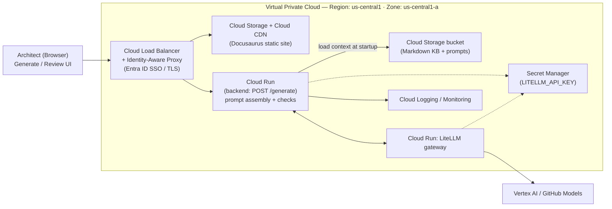

# AI4EA — Cloud Deployment Diagram

Target cloud deployment architecture for AI4EA, showing the Architect's browser
entering through an Identity-Aware Proxy into a Virtual Private Cloud that hosts the
Docusaurus static site, the backend on Cloud Run, the LiteLLM gateway, the Markdown
knowledge base, and supporting services (Secret Manager, Logging/Monitoring), with
model inference served by Vertex AI / GitHub Models.

## Components

- **Architect (Browser):** Uses the Generate / Review UI; all traffic enters through the proxy.
- **Cloud Load Balancer + Identity-Aware Proxy:** Terminates TLS and enforces Entra ID SSO before requests reach any service.
- **Cloud Storage + Cloud CDN:** Serves the Docusaurus static site (frontend).
- **Cloud Run (backend):** Handles `POST /generate`, performing prompt assembly and output checks.
- **Cloud Storage bucket:** Holds the Markdown knowledge base and prompts; loaded by the backend at startup.
- **Cloud Run: LiteLLM gateway:** Central LLM gateway the backend calls for completions.
- **Cloud Logging / Monitoring:** Collects logs and metrics from the backend.
- **Secret Manager:** Stores `LITELLM_API_KEY`, retrieved at runtime by the backend and gateway.
- **Vertex AI / GitHub Models:** Model inference providers reached through the LiteLLM gateway (outside the VPC).
