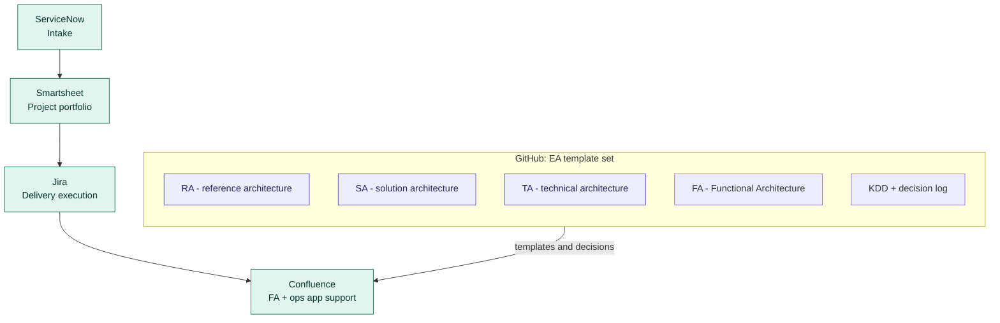
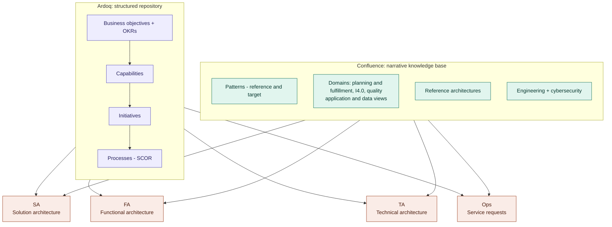

# EA design structure

## Additional Inputs
### Reference Architecture
- By Domain
- Decision Log

### Project Related
- [BRD](https://entegris.sharepoint.com/:w:/s/Enterprise_Architecture/EX50vsst_wBNj8aEjzGJPY4BSpc3Yrrbz5jHuX8RE5HzDA?e=6uId4n) - not an architecture artifact - its an input
- [Solution Architecture - can't be SAD Entegris Architecture Document](https://entegris.sharepoint.com/:w:/s/Enterprise_Architecture/EUR43xRht4ZLix0McrCDQpEBhRmEVpIlGmkhc86x4Is9xw?e=WdnUXV)-
- Key Design Decisions - need a template

Captured from the whiteboard session on 2026-08-12. Two views:

1. **Toolchain** — where artifacts live and how work moves from intake to published documentation.
2. **Content model** — what belongs in Ardoq vs. Confluence, and which architect role consumes it.

---

## 1. Toolchain: intake to published documentation

**Reading it**

- ServiceNow is the front door for demand; Smartsheet carries the project portfolio; Jira carries delivery.
- GitHub is the source of truth for the template set and the decision record. Templates are authored and versioned there.
- Confluence is the published, human-readable layer — functional architecture pages and operations / application support content.

---

## 2. Content model: Ardoq, Confluence, and the architect roles

**Reading it**

- Ardoq holds the structured, queryable model. The arrows inside it are the traceability chain — objectives to capabilities to initiatives to processes — not a workflow sequence.
- Confluence holds the narrative that structure cannot carry: patterns with explicit reference and target states, domain pages, reference architectures, engineering and cybersecurity guidance.
- All four roles consume both. The distinction is that Ardoq answers "what exists and how does it connect," Confluence answers "how do we build it."

---

## Open items from the board

| Item | Interpretation used | Needs confirmation |
| --- | --- | --- |
| `hDD` under the decision log | Read as **ADD** — architecture decision document | If the intent was ADR, the label changes but not the placement |
| `Jeff` next to business objectives / OKRs | Treated as an ownership annotation, not a structural element | Whether ownership should be modeled explicitly in Ardoq |
| `Printing` above patterns | Omitted — appears to be a domain example rather than a layer | Whether it belongs alongside planning / I4.0 / quality |
| `SR` below Ops | Modeled as service requests inside the Ops role | Whether service requests need a feedback edge back to intake |
